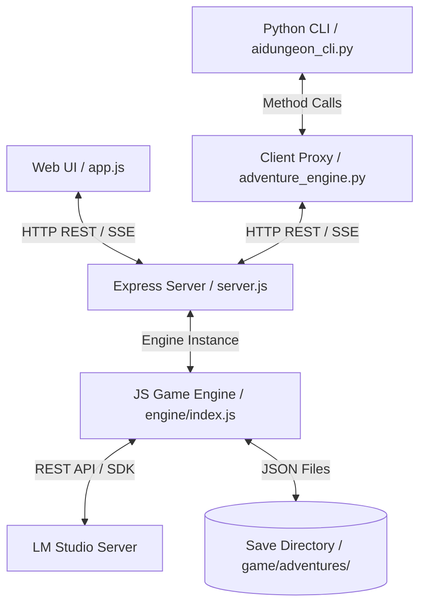

# Backend Status & Architecture Documentation

This document describes the current architecture, components, features, and API specifications for the backend of the Local LLM Text-Adventure project.

---

## 🏗️ Architecture Overview

The backend has been refactored from Python (Flask) to Node.js (Express), with a modular structure:
1. **Express Web Server (`web/server.js`)**: Serves static templates/assets and mounts modular route handlers.
2. **Modular Game Engine (`engine/`)**: Implements game state management, context summarization, and LLM streaming/completion coordination.
3. **HTTP Client Proxy (`game/adventure_engine.py`)**: A transparent client wrapper that allows the existing Python CLI (`game/aidungeon_cli.py`) and unit test cases to communicate with the Express backend, with a local Python fallback for isolated test mocks.



---

## ⚙️ Core Enhancements & Status

### 1. Dynamic Model Resolution (`get_loaded_model`)
*   **Status**: **Fully Operational**
*   **Behavior**: Instead of hardcoding model names (e.g., `gemma-4-26b-a4b-it`), the engine queries LM Studio’s native `/api/v1/models` endpoint at startup, loading, and turn execution.
*   **Mechanics**:
    1. Probes `/api/v1/models` to find any model of type `llm` with non-empty `loaded_instances` (currently in VRAM/RAM).
    2. Falls back to the first available `llm` model key.
    3. Falls back to standard OpenAI compatible `/v1/models` if the v1 native endpoint fails.
    4. Automatically filters out `embedding` models.
    5. Checks types (`isinstance(model_id, str)`) to prevent unit test mocks (`MagicMock`) from leaking into state variables, keeping unit tests clean.

### 2. Backend Stream Interception & Buffering
*   **Status**: **Fully Operational**
*   **Behavior**: Hides the bracketed game status line `[Status: <Location> | Score: <Score>]` from streaming to the client.
*   **Mechanics**:
    *   As chunks arrive from LM Studio, the backend checks for the `[` character.
    *   If `[` is found, the engine pauses streaming and buffers the text.
    *   If the buffer length exceeds `150` characters (meaning it's regular story text), the buffer is flushed and streamed.
    *   At the end of the stream, if the buffer matches the status line regex `^\[Status:\s*(.*?)\s*\|\s*Score:\s*(\d+)\s*\]$`:
        *   The metadata is parsed to update `self.location`, `self.score`, and `self.moves`.
        *   The buffer is discarded (never sent to the client).
        *   The status block is trimmed from the saved history.
    *   If it does not match, it is yielded as a standard text chunk.

### 4. Universal Barter & Quest Goal Engine

*   **Status**: **Fully Operational**
*   **Behavior**: Provides a deterministic, SQLite-backed barter trade system and NPC quest goal state machine, supporting item-for-item swaps with no currency and state transitions (`NOT_STARTED` → `COMPLETED`).
*   **Components**:
    *   `engine/memory/barterEngine.js` — `BarterEngine` class managing `barter_offers` and `quest_goals` tables.
    *   `engine/memory/structuredStore.js` — Added `hasItem()`, `executeTrade()` methods for pre-action gating and atomic swaps.
    *   `engine/index.js` — Exposes `registerOffer()`, `executeBarter()`, `getOffers()`, `createGoal()`, `getGoals()`, `completeGoal()` proxy methods.
    *   `engine/llm.js` — Pre-action gating now detects `barter X to Y` and `exchange X for Y` patterns in addition to `trade X for Y`.
*   **Trade Flow**:
    1. `hasItem()` checks inventory for `status = 'held'` with case-insensitive name match (pre-action gate, $0 LLM cost).
    2. `executeTrade()` runs an atomic SQLite transaction: marks required item as `'traded'`, inserts/replaces offered item as `'held'`.
    3. On success, a `[SYSTEM EVENT: Barter successful! Traded 'X' for 'Y'.]` message is injected into the SSE stream before LLM narration.
*   **Quest Goal Flow**:
    1. `createGoal()` inserts a goal with `status = 'NOT_STARTED'`.
    2. `completeGoal()` validates `hasItem()`, transitions to `'COMPLETED'`, and grants the reward item via `executeTrade()`.
*   **API Endpoints**:
    *   `POST /api/trade/offer` — Register a barter offer.
    *   `GET /api/trade/offers?trader=<name>` — List offers for a trader.
    *   `POST /api/trade` — Execute a trade (SSE stream with system event + LLM narration).
    *   `POST /api/goals` — Create a quest goal.
    *   `GET /api/goals` — List active (non-completed) goals.
    *   `POST /api/goals/complete` — Complete a goal (SSE stream).

### 5. Dynamic Local Network (LAN) Binding
*   **Status**: **Fully Operational**
*   **Behavior**: Enables remote devices on the same Wi-Fi/local network to access the web panel without compromising automated test environments.
*   **Mechanics**:
    *   When running test suites (where environment variable `MOCK_LLM=1` is set), the server binds to `127.0.0.1` (localhost) to avoid macOS firewall permission prompts and network lookup delays.
    *   In normal play mode, the server binds to `0.0.0.0:5001` (all network interfaces), making the game server reachable on the local network (e.g. at `http://<your-mac-ip>:5001`).

---

## 🔌 API Endpoint Specifications

### 1. General & Connectivity
*   **`GET /`**: Renders the main retro UI (`index.html`).
*   **`GET /api/presets`**: Returns available story templates (preset universes, descriptions, and character templates).
*   **`GET /api/ping`**: Probes the LM Studio port and returns status, active model, and list of all available models.
*   **`GET /api/debug/info`**: Returns LLM call info and system debug logs.
    *   *Output*:
        ```json
        {
          "status": "online" | "mock" | "offline",
          "host": "192.168.1.100",
          "port": "1234",
          "model": "gemma-4-e4b-uncensored-hauhaucs-aggressive",
          "models": ["gemma-4-e4b-uncensored-hauhaucs-aggressive", "google/gemma-4-e4b"],
          "base_url": "http://192.168.1.100:1234/v1"
        }
        ```

### 2. Game Lifecycle & State
*   **`POST /api/init`**: Initializes a new game instance.
*   **`POST /api/state`**: Updates server state with provided parameters.
*   **`GET /api/state`**: Returns current game variables, suggestion chips, system prompts, lore context cards, and history.
    *   *Output*:
        ```json
        {
          "adventure_id": "dbe9a132",
          "title": "Star Wars: The Outer Rim",
          "location": "Starting Location",
          "score": 0,
          "moves": 1,
          "history": [{"role": "user", "text": "..."}, {"role": "assistant", "text": "..."}],
          "cards": [],
          "summary": "The Galactic Empire...",
          "system_prompt": "You are the narrator...",
          "suggestions": ["Search the area", "Talk to the pilot"],
          "max_tokens": 300,
          "model": "gemma-4-e4b-uncensored-hauhaucs-aggressive"
        }
        ```

### 3. Gameplay Turns (SSE Stream)
*   **`POST /api/action`**: Receives an action and returns a text/event-stream Server-Sent Events (SSE) feed.
    *   *Input*: `{"action_type": "do" | "say" | "continue" | "retry" | "undo", "text": "open mailbox"}`
    *   *Events Yielded*:
        *   `data: {"type": "status", "content": "Querying model..."}`
        *   `data: {"type": "system", "content": "LORE ACTIVATED: Korr"}` *(optional)*
        *   `data: {"type": "chunk", "content": "You open the small "}` *(narrative text stream)*
        *   `data: {"type": "done", "content": "You open the small mailbox."}` *(generation finished)*
        *   `data: {"type": "error", "content": "error message details"}` *(on failure)*

### 4. Settings & Utilities
*   **`POST /api/settings`**: Updates runtime configuration values.
    *   *Input*: `{"max_tokens": 200, "model": "google/gemma-4-e4b"}`
    *   *Output*: `{"status": "success", "changed": ["max_tokens=200", "model=google/gemma-4-e4b"]}`
*   **`POST /api/system`**: Manually overwrites the active narrator prompt rules.
    *   *Input*: `{"system_prompt": "New system prompt instructions..."}`
*   **`POST /api/summary`**: Overwrites the compressed adventure memory summary.
    *   *Input*: `{"summary": "Updated adventure summary..."}`

### 5. Lorebook Configuration
*   **`POST /api/lore`**: Manually edits context cards.
    *   *Input options*:
        *   Add card: `{"action": "add", "card": {"name": "Staff", "type": "item", "description": "Wooden staff", "triggers": "staff"}}`
        *   Update card: `{"action": "update", "index": 0, "card": {...}}`
        *   Delete card: `{"action": "delete", "index": 0}`
        *   Toggle card: `{"action": "toggle", "index": 0}`
*   **`POST /api/scan`**: Triggers a manual LLM scan over recent history to automatically extract context cards.

### 6. Save Slots Management
*   **`GET /api/saves`**: Lists all saved adventure connection JSON slots under `game/adventures/`.
*   **`POST /api/saves/<id>`**: Loads the saved adventure variables into the active engine instance.
*   **`DELETE /api/saves/<id>`**: Deletes the saved adventure JSON file from disk.

---

## 🧪 Testing Coverage

The entire backend status is covered by 45+ integration/unit tests:
1. **API Endpoints (`tests/test_api_endpoints.py`)**: Tests route handling, SSE stream formats, settings updates, save slots, lore modifications, barter trade SSE streams, goal creation and completion SSE streams.
2. **Barter Engine (`tests/test_barter_engine.py`)**: Tests barter contract creation, valid trade atomic swap, unowned item rejection, partial quantity trades, goal creation, goal state transitions, goal completion with reward insertion, and active goal listing.
3. **CLI Behavior (`tests/test_cli_behavior.py`)**: Tests context compression threshold, dynamic response length limits (brevity instructions for simple actions), history undos, and prompt creations.
4. **PTY Integration (`tests/test_pty_integration.py`)**: Tests keyboard input loops in terminal-only modes.
5. **E2E Playwright Browser (`tests/e2e/test_menu_navigation.py`)**: Tests UI actions (init, character setup, keyboard menus, confirm panels, exits, and loads) interacting with a running mock Node.js Express server process.
6. **E2E Barter UI (`tests/e2e/test_barter_ui.py`)**: Tests action chip rendering, Barter Modal open/close, and one-click trade execution in the browser.

---

## 🧩 MCP Server (`mcp/server.js`)

The MCP (Model Context Protocol) server provides a JSON-RPC interface for AI agents to autonomously playtest and debug the game. It exposes 17 tools organized into 6 categories.

### Architecture

```
MCP Client (AI Agent)  ←→  JSON-RPC over stdio/SSE  ←→  mcp/server.js  ←→  AdventureEngine
```

- **Standalone process**: Runs as `node mcp/server.js`, separate from the Express web server.
- **Independent engine instance**: Creates its own `AdventureEngine` (avoids contention with web UI).
- **Direct engine access**: Calls `AdventureEngine` methods directly (no HTTP wrapping).
- **Transports**: Supports stdio (default) and SSE (`--transport sse`).
- **SDK**: Uses `@modelcontextprotocol/sdk` (official Anthropic SDK).

### Tool Categories

| Category | Tools | File |
|----------|-------|------|
| Session Lifecycle | `dungeon_init_session`, `dungeon_list_saves`, `dungeon_load_save` | `mcp/tools/session.js` |
| Core Gameplay | `dungeon_send_action`, `dungeon_undo_action` | `mcp/tools/gameplay.js` |
| State Inspection | `dungeon_inspect_state`, `dungeon_inspect_history`, `dungeon_inspect_lore` | `mcp/tools/state.js` |
| Memory & Inventory | `dungeon_inspect_inventory`, `dungeon_inspect_events`, `dungeon_inspect_stats`, `dungeon_search_memories` | `mcp/tools/memory.js` |
| Barter & Quests | `dungeon_inspect_offers`, `dungeon_execute_trade`, `dungeon_inspect_goals`, `dungeon_complete_goal` | `mcp/tools/barter.js` |
| Diagnostics | `dungeon_get_debug_info` | `mcp/tools/diagnostics.js` |

### Usage

```bash
# Start with stdio transport (default, for MCP-compatible AI agents)
node mcp/server.js

# Start with SSE transport (for HTTP/EventSource clients)
node mcp/server.js --transport sse --port 3100

# Via npm script
npm run mcp
```

### Key Design Decisions

1. **Force-flush before reads**: Memory inspection tools (`dungeon_inspect_inventory`, `dungeon_inspect_events`, `dungeon_inspect_stats`) call `flushIfReady(state, model, save, { force: true })` before reading to ensure data freshness, mirroring the pattern in `web/routes/memory.js`.

2. **Error handling**: Tool errors are returned as structured error content with `isError: true` rather than JSON-RPC error responses, following MCP SDK conventions.

3. **Stream collection for actions**: `dungeon_send_action` collects the full LLM response stream, parses the status line `[Status: <Location> | Score: <N> | Moves: <N>]`, and returns the narration text alongside structured metrics.

### File Organization

```
mcp/
├── server.js              # Entry point, transport setup, engine instantiation
└── tools/
    ├── index.js           # Tool registration orchestrator
    ├── session.js         # Session lifecycle tools
    ├── gameplay.js        # Core gameplay tools
    ├── state.js           # State inspection tools
    ├── memory.js          # Memory and inventory tools
    ├── barter.js          # Barter and quest tools
    └── diagnostics.js     # Diagnostics tool
```

### Testing

93 MCP tests across 7 test files:

| Test File | Coverage |
|-----------|----------|
| `tests/test_mcp_protocol.py` | Tool discovery, schema validation, stdio transport, JSON-RPC format |
| `tests/test_mcp_session.py` | Session lifecycle (init, list saves, load save) |
| `tests/test_mcp_gameplay.py` | Action execution, undo, status metrics |
| `tests/test_mcp_state.py` | State inspection (state, history, lore) |
| `tests/test_mcp_memory.py` | Memory tools (inventory, events, stats, search) |
| `tests/test_mcp_barter.py` | Barter and quest operations |
| `tests/test_mcp_diagnostics.py` | Debug info retrieval |
| `tests/test_mcp_tools.py` | All 17 tools individually |

Run with: `pytest tests/test_mcp_*.py -v`
