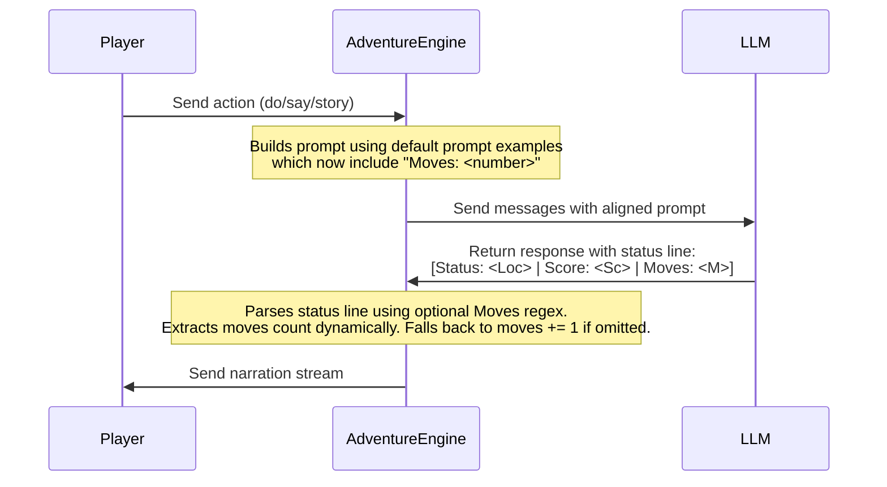

## Context

The default system prompt examples in `engine/index.js` omit the `Moves` field from the status line examples. This confuses reasoning models, causing them to omit `Moves` from the status line. The engine's status parser uses an optional group to parse the `Moves` field. When it is omitted, the engine falls back to incrementing moves by 1. By aligning the prompt's examples to include `Moves: <number>`, reasoning models will output the moves count.

## System Architecture Diagram

## Goals / Non-Goals

**Goals:**
- Align the `DEFAULT_SYSTEM_PROMPT` in `engine/index.js` examples to include the `Moves` field.
- Ensure reasoning models receive clear instructions and matching examples to output `Moves: <number>` in status lines.

**Non-Goals:**
- Do not modify `engine/storyPresets.js` as they are already updated.
- Do not make the parser regex in `engine/llm.js` mandatory (keep it optional to preserve backward compatibility).
- Do not modify the deprecated Python code in the `game/` folder.
- No frontend/web changes required — moves value is already rendered from the parsed status line.

## Decisions

- **Decision 1: Add Moves to DEFAULT_SYSTEM_PROMPT Examples**: 
  - *Rationale*: This is the root cause of the mismatch. The instruction requires the moves field, but the examples omit it. Updating the examples to match resolves the LLM confusion.
  - *Alternatives considered*: Make Moves deterministic in the backend and remove it from LLMs entirely. Rejected because it would break "free actions" (like checking inventory or score) and multi-turn waiting where the LLM is expected to control the moves advancement.
- **Decision 2: Keep Moves Optional in Parser Regex**: 
  - *Rationale*: Ensures backward compatibility with custom system prompts, old stories, and mock LLM outputs in the test suite without breaking existing saves or test behavior.
  - *Alternatives considered*: Make Moves required in the regex. Rejected because it would break existing test assertions like `test_optional_moves_counter_parsing` and custom prompts lacking the Moves field.

## Risks / Trade-offs

- **Risk: Mock LLM output doesn't match the new prompt format**
  - *Mitigation*: The parser regex remains optional. The test suite checks that the parser falls back gracefully to `moves += 1` if `Moves` is not outputted by the LLM. This prevents mock LLM test failures.
- **Risk: Some models still omit `Moves` despite aligned examples**
  - *Mitigation*: The optional parser regex preserves the fallback path (`moves += 1`), so play continues unaffected. See Decision 2.

## Testing

- The existing fallback test (`test_optional_moves_counter_parsing`) serves as a regression guard, ensuring the parser gracefully handles status lines that omit `Moves`.
- A new assertion should verify that `DEFAULT_SYSTEM_PROMPT` in `engine/index.js` includes at least one example containing the `Moves:` field, preventing future regression of the alignment.
