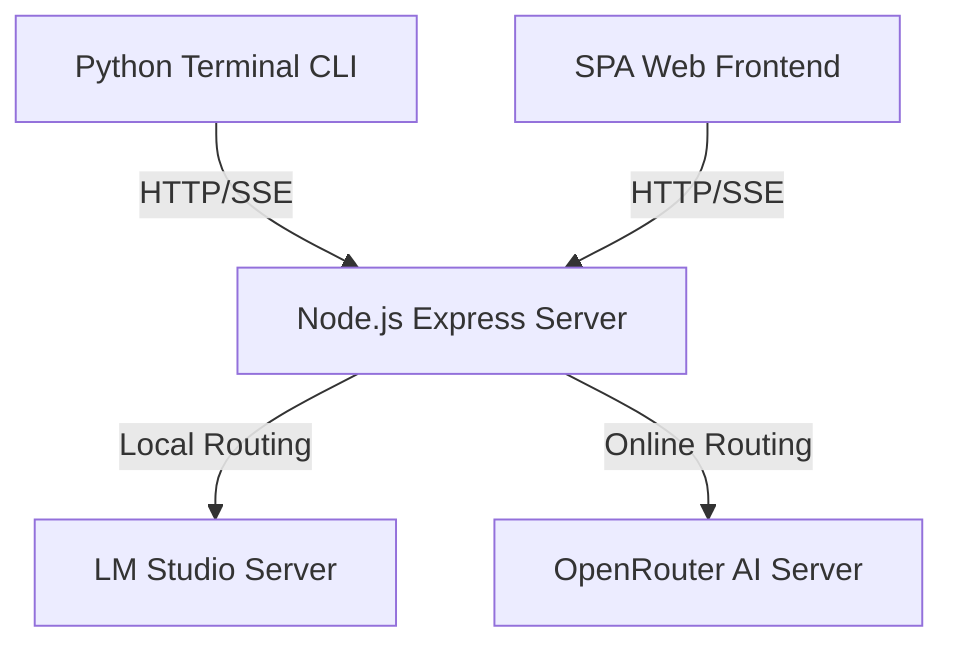

## Context

The system supports dynamically routing LLM requests between a local host (LM Studio) and an online host (OpenRouter), using standard environment parameters.

## System Architecture Diagram

## Goals / Non-Goals

**Goals:**
- Enable configuration of model endpoints through `MOCK_LLM`, `LLM_BACKEND`, `LM_STUDIO_HOST`, `LM_STUDIO_PORT`, and `OPENROUTER_API_KEY`.
- Support auto-detecting the currently loaded model on LM Studio.
- Implement failover logic where a request retry uses a newly loaded model if the original model loading fails.

**Non-Goals:**
- Simultaneously sending requests to multiple active backends on a single turn.

## Decisions

- **Environment-driven Selection**: Determine backend connection configuration inside `buildClient()` in `engine/llm.js` on startup.
- **Failover Retry Policy**: If a completion call throws model loading errors, the engine dynamically lists currently active models via LM Studio REST endpoint and retries on the first available model.

## Risks / Trade-offs

- **OpenRouter Key Leaks**: Setting a plain API key in `.env` could leak credentials.
  - *Mitigation*: Ensure `.env` is ignored by git and keep placeholder validation in the client loader.
