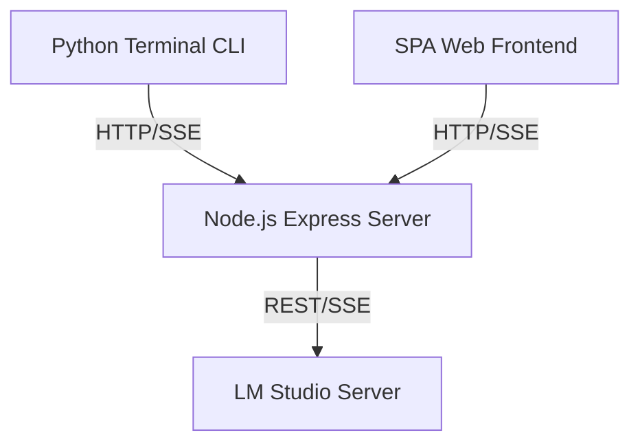

## Context

The workspace provides a dual-client system: a retro-styled Python terminal CLI and a Single Page Application (SPA) Web UI. Both clients interact with a Node.js Express server that acts as a proxy/state manager, which in turn queries a local Large Language Model (LLM) server via LM Studio.

## System Architecture Diagram

## Goals / Non-Goals

**Goals:**
- Provide a modular backend proxy to handle game session state, saves, and lorebooks.
- Allow users to play the text adventure game via both CLI and a visual web frontend seamlessly.
- Implement state sync so both CLI and Web clients access identical game engine logic.

**Non-Goals:**
- Multiplayer game synchronization or server-authoritative databases.
- Real-time graphics or heavy client-side assets.

## Decisions

- **Express State Hub**: Run a local Node.js server to persist the active game state in-memory and expose REST/SSE endpoints. This keeps game logic centralized and shared between Python CLI and Web UI.
- **Python Subprocess Management**: The Python CLI spawns the Node.js Express server automatically on startup as a background subprocess, ensuring zero manual setup for CLI-only players.
- **LM Studio Integration**: Standardize on OpenAI API-compliant completions and embeddings endpoints to support a wide range of local models.

## Risks / Trade-offs

- **Subprocess Leak**: If the Python CLI crashes or is force-killed, the Node.js background process could persist.
  - *Mitigation*: Register an `atexit` signal handler in python to terminate/kill the server process gracefully.
- **Port Conflict**: Express binding defaults to port 5001. If already in use, startup will fail.
  - *Mitigation*: Read the `PORT` environment variable to allow dynamic configuration.
