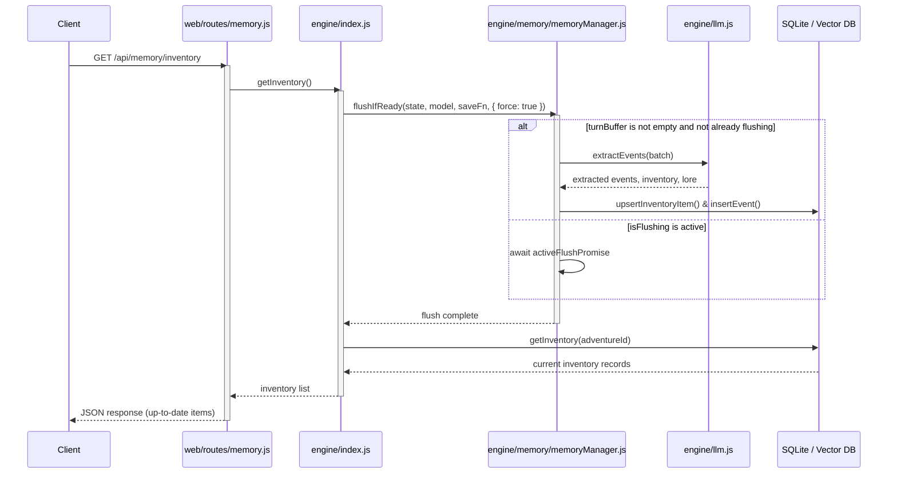

## Context

The game uses `MemoryManager` to extract gameplay events and inventory changes. Turns are buffered in `turnBuffer` and only flushed/summarized in batches of 3. This saves API costs but causes a delay where the player's starting inventory (defined on Turn 1) remains empty and unpopulated until Move 4 or 5.

Furthermore, the game engine's internal moves counter can drift from the LLM's understanding due to system prompts not instructing the model to output moves in the status line, despite the spec requiring moves to be parsed from the status line.

## System Architecture Diagram (Target State)

## Goals / Non-Goals

**Goals:**
- Guarantee that the user's inventory screen is populated with starting items immediately when the game starts.
- Ensure any pending actions in the buffer are flushed and extracted before returning inventory, event logs, or search results to the client.
- Align the narrator prompts and engine status parsing to dynamically synchronize the `moves` counter from the LLM response without freezing on malformed outputs.

**Non-Goals:**
- Eliminate the batching of 3 turns during normal gameplay command processing when read endpoints are not accessed.
- Run synchronous extraction on every turn when no client read requests are made.

## Decisions

- **Decision 1: Buffer Turn 1 on Adventure Init**
  - *Detail*: In `/api/init`, buffer the character description and the opening scene as `turnIndex = 1`.
  - *Rationale*: Prepares the starting context for immediate extraction on the first move.
- **Decision 2: On-Demand Force-Flush on State Reads and Search**
  - *Detail*: In `/api/memory/inventory`, `/api/memory/events`, `/api/memory/stats`, and `POST /api/memory/search`, trigger a force-flush of the memory manager if `turnBuffer.length > 0` before querying data.
  - *Rationale*: Guarantees data freshness for both structural records (inventory/events) and vector indexes (search) when requested, while preserving batching efficiency during blind gameplay.
- **Decision 3: Active Promise Awaiting Lock**
  - *Detail*: Store the active flush promise on `MemoryManager` as `this.activeFlushPromise`. If `flushIfReady` is called while another flush is running, return `this.activeFlushPromise` instead of exiting immediately.
  - *Rationale*: Prevents concurrent duplicate LLM calls while guaranteeing that the caller gets fresh data (rather than bailing early and returning stale records).
- **Decision 4: Flexible Moves Parsing and Prompt Refinement**
  - *Detail*: Update prompt templates to output `[Status: <Loc> | Score: <Sc> | Moves: <Moves>]`. Update both regex status parsers in `engine/llm.js` to make the moves segment optional `(?:\|\s*Moves:\s*(\d+))?`. If the moves group is matched, we set `state.moves` to that number. If it is omitted or malformed, default to manual increment (`state.moves + 1`).
  - *Rationale*: Resolves model counter drift while preventing freezes on malformed status lines or mock tests.

## Risks / Trade-offs

- **[Risk] Latency in GET Requests**: Running LLM extraction inside read endpoints introduces a 5-10s delay on that specific request.
  - *Mitigation*: This latency only occurs when the `turnBuffer` is non-empty (e.g. immediately after gameplay actions). If `turnBuffer` is empty, the flush returns immediately in under 1ms.
- **[Risk] Mock LLM or Preset Incompatibilities**: Strict moves parsing can break mock servers and existing story templates.
  - *Mitigation*: Making the moves regex group optional ensures backward compatibility with legacy formats and unit tests.
