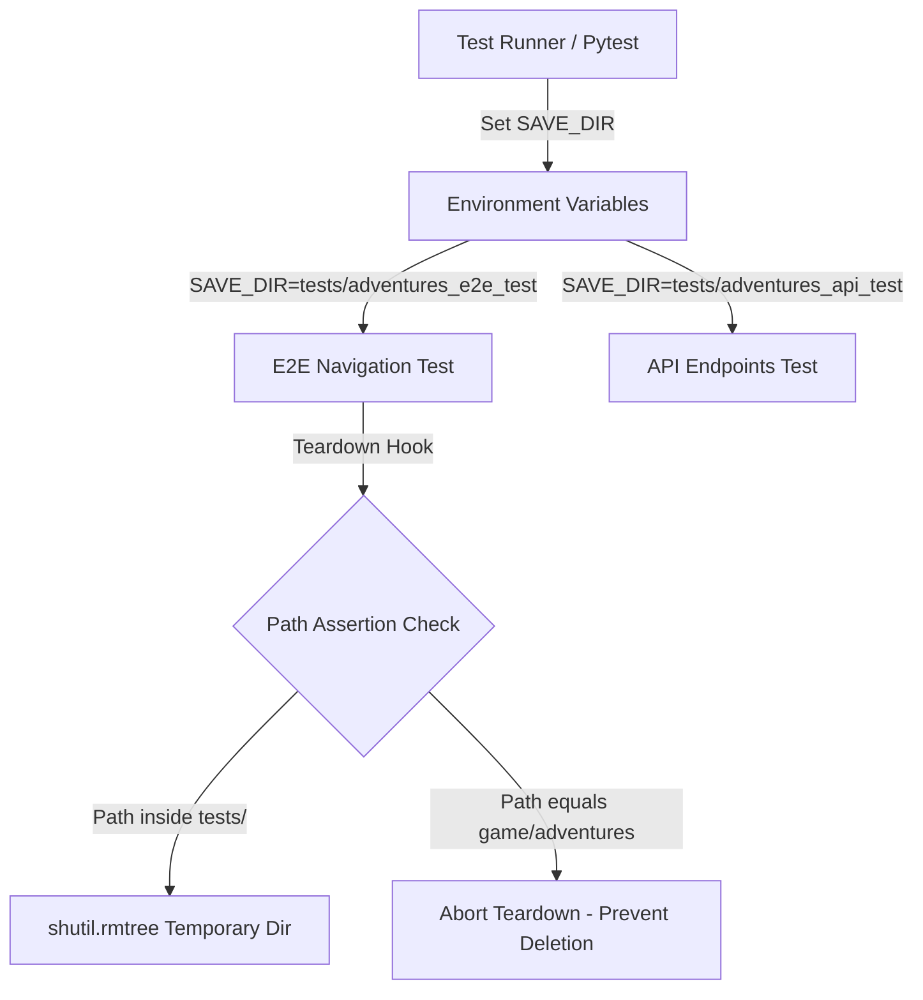

## Context

Tests spwaning Node server processes set `SAVE_DIR` environment variables or use default engine save directory paths. If `SAVE_DIR` is not explicitly isolated per test suite, test processes can target `game/adventures/`, resulting in session deletion or test file pollution.

## System Architecture Diagram

## Goals / Non-Goals

**Goals:**
- Update `tests/e2e/test_menu_navigation.py` to use `tests/adventures_e2e_test`.
- Add path guard assertions in test cleanup hooks to ensure teardowns never delete `game/adventures/`.
- Update `.gitignore` to exclude `tests/adventures_*` and `tests/presets.json`.

**Non-Goals:**
- Modifying production engine save path resolution logic in `engine/index.js`.

## Decisions

- **Dedicated Subdirectory Isolation**: Each test file uses its own `adventures_<suite>_test` directory under `tests/`.
- **Teardown Path Guards**: Teardown hooks explicitly check `os.path.abspath(save_dir).startswith(os.path.abspath(tests_dir))` and reject any attempt to delete non-test directories.

## Risks / Trade-offs

- [Risk] Running tests in parallel might collide if sharing ports → Mitigation: Socket check (`is_port_open`) prevents port collisions.
