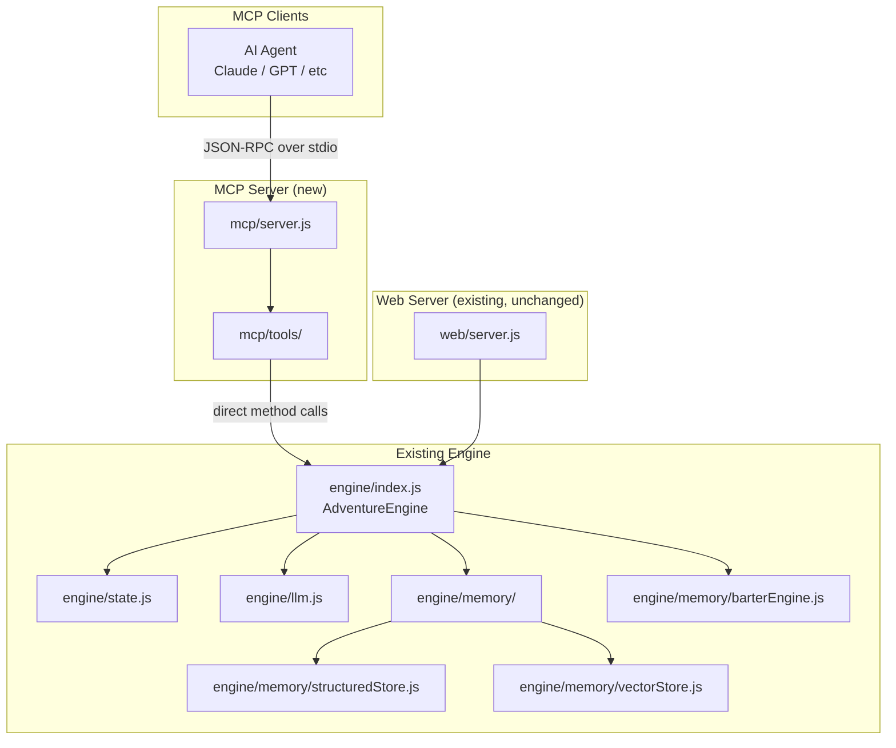

## Context

Open Dungeon currently exposes its game engine through two interfaces: a web UI (Express + vanilla JS SPA) and a deprecated Python CLI proxy. Both interfaces are designed for human interaction. To enable AI agents to autonomously playtest and debug the game, we need a third interface: a Model Context Protocol (MCP) server that exposes structured, self-describing tools.

The existing `AdventureEngine` class (`engine/index.js`) already provides all the methods needed. The Express server (`web/server.js`) wraps these methods in HTTP endpoints. The MCP server will call `AdventureEngine` methods directly, bypassing HTTP overhead.

The engine is currently a singleton (`web/engineInstance.js`). The MCP server needs its own engine instance to avoid contention with the web server during concurrent playtesting.

## System Architecture Diagram

## Goals / Non-Goals

**Goals:**
- Expose 17 MCP tools covering session lifecycle, gameplay, state inspection, memory queries, barter/quests, and diagnostics
- Run as a standalone Node.js process using `@modelcontextprotocol/sdk`
- Direct engine access (no HTTP wrapping) for efficient tool execution
- Structured input schemas and typed outputs for each tool
- Support both stdio and SSE transport modes
- Enable autonomous 10-50 turn playtests by AI agents

**Non-Goals:**
- Multi-session support (single adventure per MCP server instance)
- Modifying existing REST API or web UI
- Replacing the Python CLI proxy (already deprecated)
- Raw SQL query tool (dropped for safety; structured queries cover all use cases)
- Cloud deployment or remote MCP access (local subprocess only)

## Decisions

### 1. Standalone process vs. integrated module

**Decision**: Standalone Node.js process (`node mcp/server.js`)

**Rationale**: Isolation from the web server. Playtesting agents should not interfere with active web sessions. A separate process also simplifies testing and allows the MCP server to be started/stopped independently.

**Alternatives considered**: Embedding MCP handlers in the Express server. Rejected because it couples two distinct concerns and makes it harder to test the MCP server in isolation.

### 2. Direct engine calls vs. HTTP wrapping

**Decision**: Import `AdventureEngine` directly and call methods.

**Rationale**: The MCP server needs access to internal state (e.g., `engine.memory.structuredStore` for diagnostics) that isn't exposed via HTTP. Direct calls also avoid serialization overhead and the need for a running Express server.

**Alternatives considered**: HTTP client wrapping existing REST endpoints. Rejected because `dungeon_get_debug_info` requires access to `llmTracker` internals, and some operations (like forcing memory flush before reads) need direct engine access.

### 3. Engine instance management

**Decision**: The MCP server creates its own `AdventureEngine` instance, separate from the web server's singleton.

**Rationale**: The web server's `engineInstance.js` exports a module-level singleton. If the MCP server imported that module, it would share state with the web server. An independent instance ensures playtesting doesn't corrupt active web sessions.

**Alternatives considered**: Sharing the singleton via IPC. Rejected as overly complex for a single-session tool.

### 4. MCP SDK choice

**Decision**: Use `@modelcontextprotocol/sdk` (official Anthropic SDK for Node.js).

**Rationale**: Standard MCP implementation with built-in tool registration, schema validation, and transport handling. No reason to implement the protocol from scratch.

### 5. Transport mode

**Decision**: Support both stdio (default) and SSE transports.

**Rationale**: stdio is the standard for local subprocess MCP servers (used by Claude Desktop, etc.). SSE support enables browser-based MCP clients and remote debugging scenarios.

### 6. File organization

**Decision**: `mcp/server.js` for the entry point, `mcp/tools/` for tool implementations organized by category (session.js, gameplay.js, state.js, memory.js, barter.js, diagnostics.js).

**Rationale**: Mirrors the existing modular structure of the codebase (e.g., `web/routes/`, `engine/memory/`). Each tool file exports a function that registers its tools with the MCP server.

## Risks / Trade-offs

- **[Single session]** Only one adventure can be active per MCP server instance. Multiple agents would need separate server processes. → Mitigation: Document this limitation. Multi-session support can be added later if needed.

- **[Engine duplication]** The MCP server creates a second `AdventureEngine` instance, duplicating SQLite connections and vector store state. → Mitigation: Both instances operate on the same data directory, so they share the same underlying files. WAL mode ensures safe concurrent reads.

- **[LLM costs]** Autonomous agents can trigger many LLM API calls via `dungeon_send_action`. → Mitigation: The existing `llmTracker` already tracks session costs. The `dungeon_get_debug_info` tool exposes cost data so agents can self-regulate.

- **[Memory flush timing]** Events and inventory changes are extracted asynchronously. If an agent queries immediately after an action, data may not be flushed yet. → Mitigation: Each inspection tool calls `forceFlushBeforeRead()` (same pattern as `web/routes/memory.js`) to ensure data is current.

- **[SDK maturity]** The `@modelcontextprotocol/sdk` is relatively new. → Mitigation: The SDK is the official reference implementation and follows the stable MCP specification. If issues arise, the tool handlers are isolated and can be adapted.
