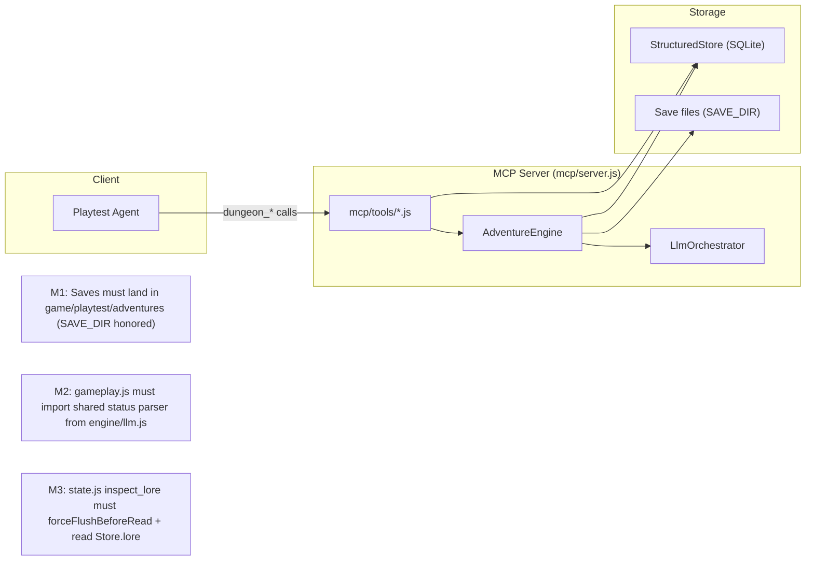

## Context

The MCP server (`mcp/server.js`) hosts a single `AdventureEngine` instance and registers 17 tools via `mcp/tools/*.js`. Three defects were confirmed live:

1. **M1 (save isolation):** `.mcp.json` sets `SAVE_DIR=game/playtest/adventures`, but sessions persist to `game/adventures/`. The engine reads `process.env.SAVE_DIR` only at construction (`engine/index.js:48-57`) and falls back to production when unset. The suspected cause is the `${OPEN_DUNGEON_MOCK_LLM:-0}` shell-style expansion in `.mcp.json`'s `env` block, which MCP clients may drop — taking `SAVE_DIR` with it.
2. **M2 (status parsing):** `mcp/tools/gameplay.js:17-49` reimplements status parsing independently of the engine (`engine/llm.js:418,433`), is case-sensitive (`^\[Status:`), and returns values that diverge from what the engine persists.
3. **M3 (stale lore):** `mcp/tools/state.js:95-132` (`dungeon_inspect_lore`) reads `engine.cards` from memory without the `forceFlushBeforeRead` pattern used by its sibling tools in `mcp/tools/memory.js`, so it reports stale/empty results while the SQLite `lore` table holds authoritative rows.

## System Architecture Diagram

## Goals / Non-Goals

**Goals:**
- Playtest saves reliably persist to the isolated sandbox directory, never silently to production.
- `dungeon_send_action` status metrics come from one shared parser that matches what the engine commits.
- `dungeon_inspect_lore` reflects the authoritative store, freshly flushed, consistent with sibling inspect tools.

**Non-Goals:**
- Not fixing the engine's end-anchored parser bugs themselves (that is `harden-context-history-integrity`, #12).
- Not changing the MCP protocol surface (still 17 tools, same names/schemas).
- Not auto-migrating already-misplaced production saves.
- Not altering the barter/goal tool behavior.

## Decisions

**D1 — Shared parser lives in `engine/llm.js` (or a small util), exported and imported by MCP.**
The behaviorally-correct line-scanning implementation currently in `gameplay.js` becomes the canonical parser. `engine/llm.js` exports it; `mcp/tools/gameplay.js` imports it and deletes its local `parseStatusLine`. This satisfies #12's "one shared function" direction and removes case-sensitivity. *Alternative rejected:* fixing only the MCP regex in place — would leave two parsers that can still drift. *Coordinate:* land together with `harden-context-history-integrity` to avoid a transient import.

**D2 — `dungeon_inspect_lore` force-flushes and reads the structured store.**
Adopt the exact `forceFlushBeforeRead(engine)` helper from `mcp/tools/memory.js` (export it) and map `structuredStore.getLore(adventureId)` rows to the same output shape (id, name, type, description, triggers, enabled). `engine.cards` remains the prompt-injection surface; the tool no longer conflates the two.

**D3 — SAVE_DIR fix: remove the `${...}` expansion risk and verify resolution.**
Two-part: (a) change `.mcp.json` `MOCK_LLM` env to a plain value (`0`) or a client-portable literal, eliminating the shell-expansion that appears to nullify the env block; (b) add a guard/assertion in the MCP server bootstrap (or a diagnostic tool) that surfaces the resolved `SAVE_DIR` so a mis-configured client is visible instead of silent. *Alternative considered:* keeping expansion and relying on the client — rejected because the failure is silent and only discovered by inspecting where save files land.

**D4 — Expose resolved save dir in diagnostics.**
`dungeon_get_debug_info`'s `backend_status` gains a `save_dir` field (engine already holds `this.saveDir`). This makes M1 failures detectable from an agent, not just via filesystem forensics.

## Risks / Trade-offs

- **[M2 shared parser may be mid-refactor in #12]** → Land MCP changes and the engine export in the same change cycle; keep the parser a pure function so both can consume it.
- **[D1 moves parser ownership to engine/llm.js]** → Risk of import cycles between `engine/llm.js` and `mcp/tools/` is low (MCP already imports engine); verify no circular import.
- **[D3 changing `.mcp.json` env]** → Some clients may not support literal env either; the diagnostic surface (D4) is the safety net.
- **[D2 switching lore source]** → Output shape must match existing consumers (`tests/test_mcp_state.py` asserts `dungeon_inspect_lore` returns an array with required fields); keep field names stable.
