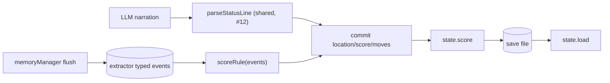

## Context

Score is a passive field today: it only changes if the narrator writes a new number into the `[Status: ... | Score: N | Moves: N]` line, and it's committed by the same (currently end-anchored, #12) status parser. The Datachip Run playtest showed a 35-turn arc where score never moved. The event extractor already produces typed events (`discovery`/`quest`/`combat`/`trade`) reliably, so those are the natural engine-side scoring signal.

## System Architecture Diagram

## Goals / Non-Goals

**Goals:**
- Score advances deterministically across a full arc (non-zero at the end of a multi-act run).
- Score commits independent of the narrator's status-line wording.
- Score round-trips through save/load.

**Non-Goals:**
- Not a leaderboard/achievement system — only that `score` reflects real progression.
- Not changing `moves` semantics (that is `harden-context-history-integrity`, #12).
- Not altering the status-line *format*, only how score is computed/committed.

## Decisions

**D1 — Engine-driven scoring is the default.** Deterministic rules over extracted milestone events (`quest` complete +N, `combat` victory +N, `discovery` of a significant item +N) applied at flush time, with a running total committed to `state.score`. *Alternative rejected:* narrator-driven contract — the playtest proved the model ignores it for 35 turns; a contract change alone is untestable and model-dependent.

**D2 — Score commits through the shared status-line path with an engine override.** `dungeon_inspect_state` and the save file read the engine-computed score, not the model's status-line claim. The model's `Score:` value, if any, is advisory. *Alternative rejected:* trusting the status line — that's the failure mode observed.

**D3 — Scoring rules live in a small pure module (`engine/scoring.js`).** `scoreRule(events, priorScore)` returns the new score; unit-testable without LLM. *Alternative:* scattering increments across turn handling — harder to test and to reason about.

**D4 — `moves` stays independent of `score`.** Score is about progression milestones; moves is the turn counter. No coupling.

## Risks / Trade-offs

- **[D1 rule definition]** → A naive rule (e.g., +1 per quest event) could inflate score from repeated events. Mitigation: score only on distinct milestones (dedup by event summary/turn), and define per-type weights in `scoring.js`.
- **[D2 engine override]** → A legitimate large score jump from the narrator would be ignored. Mitigation: that's the point — engine is authoritative; the narrator can't cheat.
- **[D3 new module]** → Tiny; no real risk.
- **[Score recompute on load]** → Persisted score is authoritative on load (no recompute), matching current save/load semantics.
