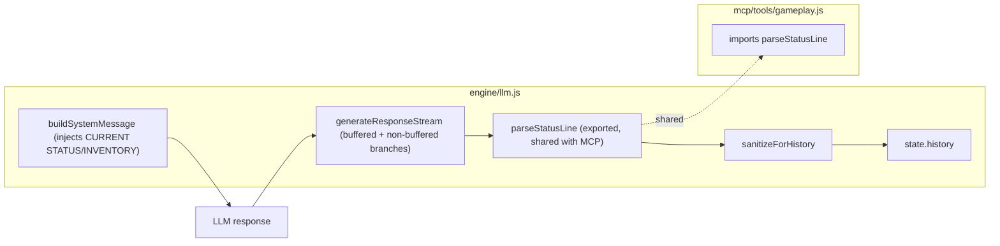

## Context

The MCP half of the status-parser problem is already fixed (archived `fix-mcp-server-tooling`): `engine/llm.js` exports `parseStatusLine` and `mcp/tools/gameplay.js` imports it. What remains here is the engine's own commit path. `engine/llm.js` still has two end-anchored regexes (`:418` buffered branch, `:433` non-buffered branch), four `moves += 1` fallbacks, and an unsanitized `state.history.push` (`:499`). The system-message injection sites (`:173,177,179`) feed `[CURRENT STATUS]`/`[CURRENT INVENTORY]` blocks that the model echoes back; the echoes are currently persisted verbatim.

## System Architecture Diagram

## Goals / Non-Goals

**Goals:**
- Status parsing uses one shared, line-scanning, case-insensitive parser on both engine and MCP sides.
- History/save/extraction content is sanitized (echoed context blocks and raw status lines stripped).
- `moves` has a single deterministic owner.

**Non-Goals:**
- Not changing the status-line *contract* (still `[Status: <Loc> | Score: <N> | Moves: <N>]`), only the parsing.
- Not changing the five prompt definitions' format unless the shared parser requires it (avoid if possible).
- Not the injection backdoor defense itself (that is `close-prompt-injection-backdoor`, #15).
- Not undo/memory-store consistency (#13/#16 batch).

## Decisions

**D1 — Replace both engine branches with the shared `parseStatusLine`.**
The buffered branch exists to hold streaming content after a `[` until the status line arrives. The shared parser already handles trailing content and case; the buffered branch can feed the same accumulator into `parseStatusLine` on stream end instead of running its own regex. *Alternative rejected:* keeping the two regexes and only fixing anchors — leaves drift risk and three parsers to maintain.

**D2 — `moves` owner: engine increments per turn; the model's status-line `Moves` is advisory.**
The research found the model's number drifted (11 vs engine's 12) and the mock emits no `Moves` at all. Making the engine the owner (increment exactly once per turn) is deterministic across real/mock modes and matches the MCP fallback (`moves !== null ? moves : engine.moves`). The model's `Moves` field, when present, SHALL be ignored for the committed counter. *Alternative rejected:* trusting the status-line number — breaks mock mode and the observed drift.

**D3 — Single `sanitizeForHistory(text, {status})` applied at commit points.**
One function strips echoed `[CURRENT STATUS]`/`[CURRENT INVENTORY]` blocks and the parsed status line, and is applied at `:499` and the other push sites (`:219,300,314`). Raw text is retained via the existing streaming/debug paths only.

**D4 — Keep the five prompt-definition format unchanged.**
Changing the contract would require touching all five definitions; the shared parser already tolerates the current format (including case and trailing content). Only revisit if a later finding shows the format itself is the problem.

## Risks / Trade-offs

- **[D1 buffered-branch rewiring]** → Risk of dropping streamed chunks. Mitigation: unit-test the buffered path with fragmented `[Status:` output (the exact mock-mode probe from the MCP change).
- **[D2 moves ownership]** → Changes observable behavior in real mode (engine counter wins over model's number). Mitigation: document; the MCP `dungeon_send_action` already falls back to engine state for null moves.
- **[D3 sanitization]** → Risk of over-stripping legitimate narration containing the token `[CURRENT INVENTORY]`. Mitigation: only strip whole `[CURRENT STATUS]`/`[CURRENT INVENTORY]` blocks (block-shaped), not arbitrary text.
- **[D4 format unchanged]** → If a preset's prompt drifts from the contract, the shared parser silently returns nulls. Mitigation: add a spec scenario asserting the five prompt definitions match the format.
