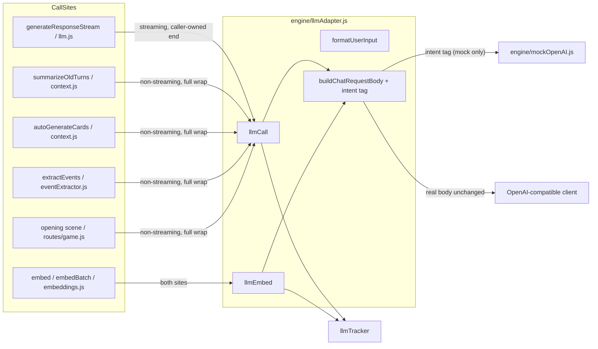

## Context

Eight call sites reach the LLM wire path. Six repeat the tracker
`startCall → create → endCall/failCall` skeleton with subtly different `kind`
labels and error policy; two more (the embedding sites) repeat the same
skeleton. The openrouter `reasoning`/`stream_options` block is duplicated across
the two narration sites in `engine/llm.js`. Mock mode is a second, parallel
world: `engine/mockOpenAI.js` dispatches canned responses off **prompt
substrings**, so a prompt edit silently changes mock behavior — the mock is
keyed to spellings, not intent. `formatUserInput` exists twice (`engine/index.js`
method shadowed by a local closure in `engine/llm.js`). Verified in-repo; no
external code.

## System Architecture Diagram

## Goals / Non-Goals

**Goals:**
- One `llmCall(client, kind, opts)` / `llmEmbed(client, kind, opts)` wire path
  for all eight call sites, owning request shaping + tracker wrap.
- Mock dispatch keyed by intent, not prompt substring; mock and real share the
  adapter's single `client.chat.completions.create` / `client.embeddings.create`
  call path.
- Real-mode request bodies byte-identical to today (the `intent` tag is added
  only when the client is a `MockOpenAI`).
- Narration keeps its `for await (chunk of stream)` generator semantics and its
  caller-owned end (sanitized text, usage recording, error event, retry-reused
  call record).
- One `formatUserInput` definition.
- Preserve tracker kind labels and each call site's error/fallback policy.

**Non-Goals:**
- Not changing `parseStatusLine` / `sanitizeForHistory` / `isSuspiciousStatus`.
- Not changing SSE event shapes, MCP tool surface (18 tools), undo/watermark/
  moves semantics, `SAVE_DIR` derivation, the port guard, or `tests/conftest.py`.
- Not touching the `EventExtractor` mock-mode fixture (history-text-keyed
  extraction is a deterministic test contract the mock-mode suite depends on).
- Not making `llmTracker` an engine-owned instance (flagged in research, raised
  but not acted on).

## Decisions

**D1 — `llmCall(client, kind, opts)` is a function, not a class.**
The adapter is the request-shaping + tracker-wrap + mock-dispatch seam. A full
`LLMAdapter` class with an intent registry (research option 2) is more structure
than the eight call sites need; a single function keeps the existing
`llmCall(client, kind, {messages, model, temperature, maxTokens, stream, ...})`
shapes. *Alternative rejected:* a class instance threaded through every call
site (constructor-DI overlaps #29, the deferred facade candidate).

**D2 — Mock mode is a request tag, not a second call site.**
`llmCall`/`llmEmbed` build one body and set `body.intent = kind` only when the
client is a `MockOpenAI` (detected via `instanceof MockOpenAI`, which also
covers the key-missing buildClient fallback). Real mode receives no `intent`
field, so real request bodies are byte-identical. The mock reads
`options.intent`; prompt-substring dispatch is deleted.

**D3 — Streaming returns `{ stream, callId }`; the narration caller owns the
semantic end.**
Narration is the only streaming call. Its end is not the wire call's end: the
tracker records the sanitized narration, usage is recorded mid-stream, the
fallback-model retry reuses one call record, and failures emit an SSE `error`
event. So `llmCall` with `stream: true` returns `{ stream, callId }` (startCall
inside unless `opts.callId` is supplied) and the caller keeps
`recordUsage`/`endCall(callId, cleanedText)`/`failCall` and the retry. The
adapter still owns request shaping + mock dispatch + the create. All
non-streaming sites get the full wrap (startCall + endCall + failCall) from the
adapter.

**D4 — The narration retry reuses one call record.**
`engine/llm.js` creates the `'narration'` callId once and passes it as
`opts.callId` to both the primary and the fallback `llmCall`, so a retried turn
stays one tracker record (today's behavior). The adapter skips `startCall` when
`opts.callId` is present.

**D5 — Each call site's error/fallback policy stays at the call site.**
The adapter wraps the wire call and rethrows; the call sites keep their local
handling: narration's fallback-model retry, context.js's summary-failure
history restore, eventExtractor's error-swallow + JSON salvage,
web/routes/game.js's canned-text fallback, embeddings.js's mock-vector
fallback. The tracker wrap they each repeated is removed from the sites.

**D6 — `formatUserInput` lives in the adapter.**
One exported definition in `engine/llmAdapter.js`; `engine/llm.js` uses it for
the live turn path and `engine/index.js`'s method delegates to it.

## Risks / Trade-offs

- **[D3 caller-owned end for narration]** — the tracker wrap for the streaming
  path is not 100% inside the adapter. This is deliberate: narration's end is
  semantic (sanitized text, usage, error event) and the retry reuses one call
  record. The adapter still owns the request shape, mock dispatch, and create.
- **[D5 adapter endCall text]** — the non-streaming adapter endCalls with the raw
  `message.content`; sites that trimmed/stripped before their (now-removed)
  `endCall` may differ in the diagnostics `response` field. No test asserts it;
  the diagnostics MCP tool exposes only id/type/status/duration/tokens/error.
- **[embeddings response.error]** — `llmEmbed` endCalls on any returned response;
  a 200-with-`.error` body is now tracked 'completed' until the site's validation
  throws (today it is 'failed'). Edge case, diagnostics-only, unasserted.
- **[D4 retry seam]** — if a future call site needs tracker-retry reuse, it must
  pass `opts.callId`; documented in the adapter JSDoc.

## Migration

No data migration. Behavior change: the mock no longer keys off prompt
substrings — a prompt edit no longer silently changes mock responses; the
intent is explicit. The `EventExtractor` mock fixture is untouched. Tracker
kind labels, SSE shapes, status-line parsing, and undo/watermark/moves
semantics are unchanged.

## Open Questions

- Whether `llmTracker` should become an instance owned by the engine (raised in
  research; module-level singleton retained).
- Whether the mock's `event_extraction` canned JSON should mirror the rich
  eventExtractor fixture (kept minimal; the fixture short-circuits before the
  adapter in mock mode).
