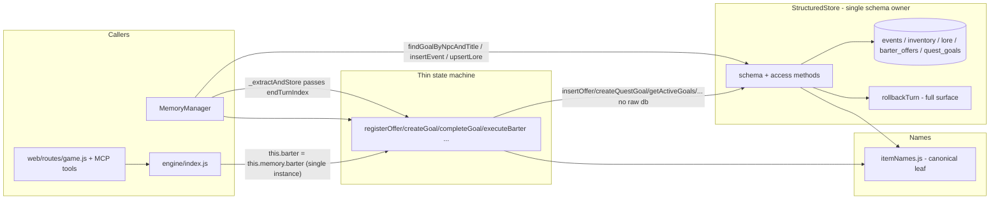

## Context

`barter_offers` and `quest_goals` have no single schema owner. `barterEngine`
declares them in `_initSchema` (`barterEngine.js:10-33`) and reaches past the
store into `this.store.db.prepare(...)` for most queries; `structuredStore`
hard-codes the same table names in `deleteAdventureData`
(`structuredStore.js:289-290`); `memoryManager` runs a raw
`SELECT id FROM quest_goals ...` for goal dedup (`memoryManager.js:250-252`).
"Do I hold this item?" has two answers: exact `LOWER()` SQL (`hasItem`,
`executeTrade`) and canonical `itemNamesMatch` (`barterEngine._findHeldItem`,
offer lookup). `rollbackTurn` covers only events + inventory
(`structuredStore.js:247-267`) while `_extractAndStore` writes lore, offers,
and goals at the same batch turn (`memoryManager.js:117-299`) — so the recorded
undo contract (`make-undo-and-trades-consistent`) is incomplete: offers/goals/
lore written by a turn survive an undo of that turn. Two `BarterEngine`
instances are built per engine (`memoryManager.js:19`, `engine/index.js:69`).
The event-id hash (`memoryManager.js:119-120`) omits `endTurnIndex`, so two
identical summaries collapse to the first turn's row. Verified in-repo; no
external code.

## System Architecture Diagram

## Goals / Non-Goals

**Goals:**
- One module (StructuredStore) declares every table and every access method;
  `barterEngine` is a thin state machine over it.
- One matching regime for "do I hold this item?" — the canonical leaf; exact
  SQL only as the fast path.
- `rollbackTurn` removes the full surface a turn can write: events, inventory,
  lore, barter_offers, quest_goals.
- Exactly one `BarterEngine` per `AdventureEngine`, shared between
  `engine.barter` and `engine.memory.barter`.
- Existing DBs upgrade via a guarded `ALTER TABLE` migration (no data loss).

**Non-Goals:**
- Not re-litigating watermark/moves/undo semantics (locked by
  `make-undo-and-trades-consistent`).
- Not changing score rules, the status parser, or the SSE/MCP wire contracts.
- Not doing the #29 facade reach-in cleanup (the engine still proxies
  `barter.*`; only the double construction is collapsed here).
- Not implementing offer expiry / per-location scoping.
- Not migrating existing row *values* (out of scope for the change; the
  migration only adds the column).

## Decisions

**D1 — `StructuredStore` owns the barter/quest schema and access; `BarterEngine`
is a thin state machine.**
`barter_offers`/`quest_goals` are declared in `structuredStore._initSchema`
(with `turn_index`); the store exposes `insertOffer`, `getOffersForTrader`,
`getAllOffers`, `createQuestGoal`, `getGoalById`, `getActiveGoals`,
`getAllGoals`, `acceptQuestGoal`, `failQuestGoal`, `completeQuestGoal`, and
`findGoalByNpcAndTitle`. `BarterEngine` calls those methods and never touches
`this.store.db`. `_initSchema` is retained on `BarterEngine` as a no-op so the
constructor remains the construction-counting seam for the single-instance
test. *Alternative rejected:* a shared `db` handle passed around — that is the
leak the change removes. Deletion test: remove `barterEngine`'s methods and
callers break, but the complexity (schema + SQL) stays in `StructuredStore`.

**D2 — One canonical matching regime.**
`hasItem` keeps the exact `LOWER()` SQL as the indexed fast path but falls back
to `itemNamesMatch` over held rows (as it does today); `executeTrade` resolves
the required item by canonical name; offer lookups (`executeBarter`,
`_resolveNarratedTrade`) use `itemNamesMatch`; `completeGoal` validates via
`hasItem` and swaps via `executeTrade`, so "the Gem" completes against a held
"Gem" and "Rusted Gear" against "Rusty Gear". `_findHeldItem` is removed — its
canonical lookup is exactly `store.hasItem`. *Alternative rejected:* a single
exact-SQL regime — would regress the canonical spellings the seam pins.

**D3 — Full-surface rollback via a `turn_index` column.**
`lore`, `barter_offers`, and `quest_goals` gain `turn_index INTEGER`.
`_extractAndStore` passes the batch `endTurnIndex` to narrated offers/goals/
lore. `rollbackTurn` deletes all five tables; for offers/goals it deletes only
`turn_index >= ? AND turn_index IS NOT NULL`, so rows with no narration turn
survive. The watermark rewind and the vector `deleteItems` behavior are
unchanged.

**D4 — `turn_index` defaulting and the NULL-turn_index rollback rule.**
When `insertOffer`/`createQuestGoal`/`upsertLore` are called without an explicit
turn index, the store defaults `turn_index` to the adventure's current max event
turn (`MAX(turn_index) FROM events`, coalesced to 0). Narration rows are always
written with the explicit batch `endTurnIndex`. Consequences:
- A row created before any extraction gets `turn_index = 0`, which never
  satisfies `turn_index >= N` for any rollback threshold `N >= 1` — it behaves
  exactly like the NULL marker and survives every undo.
- A row created mid-game (after turns have been extracted) gets the current max
  event turn and rolls back with that turn — the correct behavior when its
  creation context is undone.
- Legacy rows (added by the guarded migration, or hand-written with NULL) are
  NULL and survive rollback via the `IS NOT NULL` guard. This is the rule
  recorded for the NULL-turn_index contract: **rollback deletes only
  `turn_index >= ? AND turn_index IS NOT NULL`.**

**D5 — Guarded `ALTER TABLE` migration in `_initSchema`.**
After the `CREATE TABLE IF NOT EXISTS` block, `_initSchema` checks
`PRAGMA table_info` for `turn_index` on `lore`/`barter_offers`/`quest_goals`;
if a column is missing, `ALTER TABLE ... ADD COLUMN turn_index INTEGER` runs.
Idempotent and safe on both fresh and existing DBs.

**D6 — Event-id hash includes `endTurnIndex`.**
`_extractAndStore`'s event payload becomes
`${adventureId}:${endTurnIndex}:${type}:${summary}:${entities}` so each turn's
event is its own row; a later rollback can delete a repeated summary's row.
Score is unaffected: `scoreRule` dedups by normalized `type:summary`.

**D7 — Single `BarterEngine` instance.**
`MemoryManager` keeps its construction (`memoryManager.js:19`); `engine/index.js`
stops constructing a second one and sets `this.barter = this.memory.barter`.
The one instance is shared: `engine.memory.barter === engine.barter` and
`engine.barter.store === engine.memory.structuredStore`.

## Risks / Trade-offs

- **[D4 mid-game API rows roll back with their creation turn]** — a hand-created
  offer after extracted turns is attributed to the current turn and can be
  removed by an undo of that turn. No test pins the "API rows always survive"
  behavior, and removing a row whose creation context was undone is arguably
  correct. Rows created before any extraction (turn_index 0) always survive.
  *Mitigation:* D4's defaulting is documented; the `IS NOT NULL` guard still
  protects genuinely NULL (legacy/migrated) rows.
- **[D6 event ids change]** — an event id that previously was
  `hash(adv:type:summary:entities)` is now `hash(adv:turn:type:summary:entities)`.
  Same-turn re-extraction (replay) is still id-stable (same turn, same summary →
  same id → `INSERT OR IGNORE` / vector upsert). Cross-turn duplicate summaries
  now produce distinct rows instead of collapsing — the fix's intent.
- **[D3 rollback scope]** — deleting offers/goals with the undone turn can
  remove a goal that a later turn referenced. The locked undo contract
  (`make-undo-and-trades-consistent`) already treats a turn's writes as atomic
  with that turn; offers/goals written by narration are a turn's writes.
- **[D1 `_initSchema` no-op]** — a no-op method is retained purely as the
  construction-counting seam for the single-instance test. If the test ever
  changes, the no-op can be deleted.

## Migration

Existing DBs: `_initSchema` runs the guarded migration (D5) on construction —
`ALTER TABLE lore/barter_offers/quest_goals ADD COLUMN turn_index INTEGER` only
when the column is absent. Existing rows keep their data; their `turn_index` is
NULL, so they survive rollback. The migration is idempotent. Verified on a fresh
temp DB via `tests/unit/migration.test.mjs` (legacy-schema DB → construction →
columns present; second construction no-ops; legacy rows intact). No production
DB is touched by the test suite (temp `SAVE_DIR`/data dirs only).

## Open Questions

- Whether API-created offers/goals should be given an explicit non-narration
  marker (a distinct column) so mid-game manual rows always survive undo, rather
  than inheriting the current max event turn (D4). Left open; no contract pins it.
