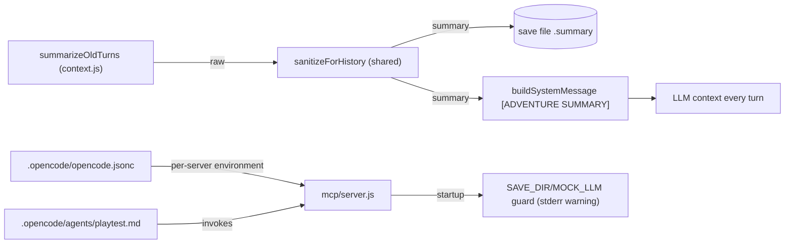

## Context

The two archived batches fixed the narration status-line path and engine-driven scoring. A playtest of those batches surfaced two gaps they did not cover: the auto-summarized `state.summary` bypassed sanitization (and is replayed as `[ADVENTURE SUMMARY]` context every turn), and the session MCP server silently ran against production saves + a real backend because OpenCode only applies env to local MCP servers via the per-server `environment` block. Separately, the project lacked a registered, repeatable playtest subagent.

## System Architecture Diagram

## Goals / Non-Goals

**Goals:**
- No raw status-line/context-block metadata in `state.summary`, the save file, or the replayed `[ADVENTURE SUMMARY]` context.
- The session MCP server resolves to the playtest sandbox and mock backend by default.
- A repeatable project-level playtest subagent exists for feature verification.

**Non-Goals:**
- Not changing the summarization prompt or the `[ADVENTURE SUMMARY]` injection format.
- Not hard-failing the MCP server on production saves (warning only).
- Not implementing `validate-memory-extraction` (#14) or `close-prompt-injection-backdoor` (#15); this is the hygiene follow-up only.

## Decisions

**D1 — Sanitize `state.summary` with the same `sanitizeForHistory` used at narration commit points.**
`engine/context.js` imports the shared sanitizer and applies it to the summarizer output before `state.summary` is committed and saved. *Alternative rejected:* a separate summary-specific stripper — two sanitizers would drift; the shared function already strips status-line-shaped lines and `[CURRENT ...]` blocks.

**D2 — The per-server `environment` block is the source of truth for MCP server env.**
`mcp.open-dungeon.environment` in `.opencode/opencode.jsonc` carries `SAVE_DIR` and `MOCK_LLM`. The session `environment` block and root `.mcp.json` are aligned copies for other consumers. Default `MOCK_LLM=1` (mock-first) so autonomous agents never burn API budget; flip to `0` for deliberate fidelity runs. *Alternative rejected:* top-level `environment` or `.mcp.json` — docs show neither is applied to OpenCode-spawned MCP servers.

**D3 — Startup guard is a loud warning, not a hard fail.**
`mcp/server.js` already logs the resolved `SAVE_DIR`; it now additionally warns when `SAVE_DIR` is unset or resolves into `game/adventures`, and when `MOCK_LLM != "1"`. *Alternative rejected:* `process.exit(1)` on production saves — a human may legitimately want production/fidelity use.

**D4 — Playtest agent as a project-level subagent, not a skill.**
`.opencode/agents/playtest.md` (mode `subagent`, `edit: deny`, `open-dungeon_*` tools allowed, model `opencode-go/deepseek-v4-flash`) makes the agent discoverable via the Task tool / `@playtest` and gives it a bounded tool surface. *Alternative rejected:* another SKILL.md — skills are prompts, not agent boundaries; a subagent adds permissions, a model, and report-loop semantics.

## Risks / Trade-offs

- **[D1 summary sanitize]** → Over-stripping legitimate summary prose containing the token `[CURRENT ...]`. Mitigation: only whole block-shaped sections and status-line-shaped lines are stripped (same rule as narration).
- **[D2 mock-first default]** → Real-model fidelity checks require flipping `MOCK_LLM` to `0`. Mitigation: documented in the config comment and the playtest agent's operating principles.
- **[D3 warning-not-fail]** → A misconfigured server can still run against production if the operator ignores stderr. Mitigation: the warning is unambiguous and includes the fix path; the config now applies env correctly.
- **[D4 agent not registered until reload]** → Until the session is restarted, `@playtest` is unavailable. Mitigation: the orchestration prompt falls back to a registered subagent (`general`) with the same playtest contract.

## Migration Plan

1. Restart the OpenCode session so `.opencode/agents/playtest.md` registers and the new per-server MCP env applies.
2. Confirm via `dungeon_get_debug_info`: `save_dir: game/playtest/adventures` and mock backend.
3. For real-model fidelity runs, set `MOCK_LLM=0` in the per-server environment (or launch `node mcp/server.js` with `MOCK_LLM=0` and a sandboxed `SAVE_DIR`).
4. Rollback: revert `engine/context.js`, the configs, `mcp/server.js`, and delete `.opencode/agents/playtest.md`; re-run the broad suite.

## Open Questions

- Whether the summary sanitize should also be applied on the **load** path (a legacy save whose `summary` field already contains a raw status line). Not addressed here; the sanitizer is idempotent and cheap, so a load-path sanitize is a candidate follow-up.
