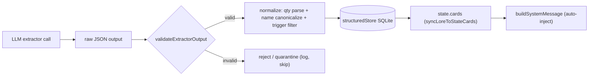

## Context

The event extractor (`engine/memory/eventExtractor.js`) produces `events`/`inventory_changes`/`lore_facts` from a JSON prompt. `engine/memory/memoryManager.js:_extractAndStore` (`:94-211`) writes those straight through to `structuredStore` (`insertEvent`, `upsertInventoryItem`, `upsertLore`) and `state.cards` via `syncLoreToStateCards`. There is no schema validation, no trigger filtering, no quantity parsing, and no name canonicalization. `engine/context.js:getActiveCards` fires any card whose trigger regex-matches, so common-word triggers burn context on nearly every turn. The summarization prompt (`context.js:59-70`) mandates third person despite the game's second-person contract.

## System Architecture Diagram

## Goals / Non-Goals

**Goals:**
- Only valid, normalized data reaches the structured store.
- Lore trigger tokens cannot be common words or mechanical vocabulary.
- Item quantities live in the `quantity` column only; names canonicalized on write.
- Summaries stay second person.

**Non-Goals:**
- Not building the player-facing lore-card delete UI (that is `close-prompt-injection-backdoor`, #15).
- Not fixing undo/trade memory consistency (#13/#16 batch), though name normalization is shared with it.
- Not changing the barter engine itself.

## Decisions

**D1 — A `validateExtractorOutput(output)` function in `eventExtractor.js`, applied in `memoryManager._extractAndStore` before writes.**
Schema-checks each row; invalid rows are skipped and logged (counted in the debug log line), valid rows flow on. *Alternative rejected:* a separate validator module — keeps the schema next to the prompt that defines it.

**D2 — Trigger filtering: reject tokens < 3 chars, single common words, and mechanical vocabulary.**
Apply a stop-list plus a length/word-hood heuristic in `validateExtractorOutput` before `upsertLore`. Cards whose entire trigger list is rejected are dropped. This is half of the #15 defense. *Alternative:* fuzzy "word frequency" lists — overkill; a short stop-list + length rule covers the observed failures.

**D3 — Quantity parsing + name canonicalization in a `normalizeInventoryChange` helper.**
Parse a leading numeral out of `item_name` into `quantity`; store a canonical name (lowercased, article-stripped for comparison). Expose a matching helper so `barterEngine` name lookups use the same normalization (ties to #13/#16). *Note:* the 3-tier matcher in `inventory-system` already handles partial matches; canonicalization makes the exact-name path in `executeBarter` reliable.

**D4 — Rewrite the summarization prompt to require second person.**
Change the prompt text and add a spec scenario + test asserting the output voice. Cheap, isolated.

## Risks / Trade-offs

- **[D2 trigger filtering false positives]** → A legitimate short trigger (e.g., `R2`) could be dropped. Mitigation: length rule is a floor (>=3); keep a small allow-list of legit short tokens if needed.
- **[D3 name canonicalization scope]** → Normalizing on write but not migrating existing rows leaves old drift. Mitigation: normalize on read as well (matching helper) so legacy rows resolve too.
- **[D1 rejection vs quarantine]** → Dropping a "bad" row could lose a real event the model mis-formatted. Mitigation: log the rejected raw JSON to the debug log for auditability (documented in #14 as "reject or quarantine").
- **[D4 second-person summary]** → Model may still drift on long sessions; mitigation is best-effort prompt + scenario coverage.
