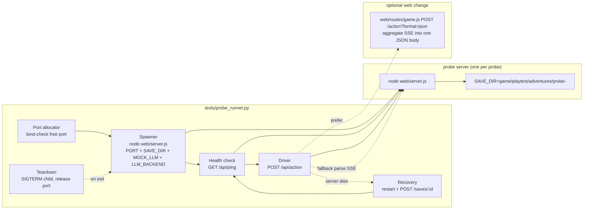

## Context

Parallel playtest probes currently hand-roll everything: hardcoded ports (5101-5104), hand-written `run.sh` spawns, bespoke SSE parsers (`act.js`, `driver.py`), manual crash recovery, and no teardown. Probe #13 (GH #34) died three times with `EXIT_CODE=137`, never auto-restored its save, and left orphaned servers. The web server already exposes every needed primitive — `GET /api/ping` (health), `POST /saves/:save_id` (resume), `POST /api/action` (drive, SSE-only today) — so the fix is a supervisor that orchestrates them, not new engine capability.

The engine's persistent layer (memory.db, vectra indexes, save files) is already multi-tenant keyed by adventure_id; process-per-probe isolation means the runner never touches that. This change deliberately keeps the engine and MCP server untouched.

## System Architecture Diagram

## Goals / Non-Goals

**Goals:**
- One command spawns, drives, and tears down a supervised probe server per probe.
- Guaranteed teardown — no orphaned `node web/server.js` after any exit path (normal, error, interrupt).
- Crash recovery restores the probe's session from its persisted save, using the existing resume route.
- Concurrency cap bounds simultaneous real-model servers.
- Optional JSON mode removes per-probe SSE-parser friction for all curl probes.
- Zero changes to the engine or MCP server.

**Non-Goals:**
- Multi-session MCP server (Option A) — deliberately deferred; no parallel-mock-collision repro exists today.
- Boot-time auto-restore in the web server — a behavior change for the web UI and production saves; resume is the runner's job.
- Per-adventure llmTracker scoping — owned by `playtest-diagnostics-hygiene` (0/16), not this change.
- Fixing the sandbox's memory ceiling or OOM behavior — the runner mitigates via cap + teardown only.
- Mock/real backend switching inside one process — each probe is a separate process with its own env.

## Decisions

**D1: Python runner under `tests/`, not a new `scripts/` or `tools/` dir.** The parallel-isolation precedent (`_pt_runner.py`) and the pytest gates are Python; probes already used Python (`driver.py`). A new `scripts/` dir adds a home for one file. Alternative considered: Node (rejected — `autoplay_runner.js` is MCP-client-side, not a supervisor).

**D2: Process-per-probe, not in-process engines.** Each probe spawns its own `web/server.js` with a unique `SAVE_DIR`. This reuses the engine as-is, inherits the already-multi-tenant persistence, and gives per-process crash isolation. Alternative (A2: `Map<sessionId, AdventureEngine>` in one process) rejected for cost/risk and because the transcript failures are all side-server failures.

**D3: Port allocation via bind-check.** Bind a socket to port 0 to learn a free port, close it, hand the number to the spawned server. Simple, no lock file, no state to clean up. Alternative (scanning 5100+ with a registry) rejected — racier and more code.

**D4: Resume via the existing `POST /saves/:save_id` route** (`web/routes/saves.js:11`). Zero server changes needed for crash recovery. The runner tracks the probe's active `adventure_id` from init responses and replays it after restart. Alternative (new resume endpoint or auto-restore-on-boot) rejected as out of scope.

**D5: SSE parser as fallback + `?format=json` as an optional additive change.** The runner MUST work against an unmodified server (SSE parser, ~30 lines), and SHOULD use JSON mode when present. This makes the server change optional and the runner robust either way. Alternative (runner depends on JSON mode) rejected — a probe pointed at an older server would break.

**D6: Teardown is explicit and idempotent.** SIGTERM the child, wait briefly, SIGKILL on timeout, release the port. Wired into `atexit`/`try-finally`/signal handlers so every exit path cleans up. Rationale: the transcript's orphaned servers are a correctness bug, not a nicety.

**D7: `--max-concurrent N` is a queuing gate, not a resource meter.** The runner starts at most N servers and queues the rest. It does not attempt to measure RSS or predict OOM (the sandbox limit is unreadable — see research). The cap is the operator's guardrail.

## Risks / Trade-offs

- [Real-model fan-out still costs N×~170MB RSS] → The cap bounds simultaneous servers; teardown prevents accumulation. The OOM root cause (sandbox limit) is outside the runner's control and unverified (research: cgroup read blocked).
- [SSE fallback parser could diverge from server behavior] → Parse only `data:` frames with `type: chunk`/`done`; JSON mode is the preferred path and covered by a spec scenario.
- [Port race: bind-check-then-spawn] → Tiny window between close and bind; acceptable for a test harness. Mitigation: spawn immediately after close; retry once on EADDRINUSE.
- [Recovery replays `POST /saves/:id` which mutates engine state] → Restart uses a fresh server process, so no cross-probe state leak; resume targets the probe's own adventure_id in its own SAVE_DIR.
- [Python runner vs the Node test stack] → Runner is a standalone script driven by the CLI/skill; pytest smoke tests invoke it as a subprocess, matching the `_pt_runner.py` precedent.

## Migration Plan

- Land the runner and docs in one change. The optional JSON mode is additive; no existing client depends on SSE-only behavior.
- Rollback: revert the change; the runner is a test-harness file plus docs, no production path depends on it.
- No data migration: no schema, engine, or save-format changes.

## Open Questions

- Runner interface shape: single `probe_runner.py` with subcommands (`run`, `list`, `kill`) vs a library class the CLI skill wraps. Default: subcommands + small library surface.
- Whether `?format=json` ships in this change or is split into a follow-up. The spec requires it; the tasks can order it so the runner works SSE-first.
