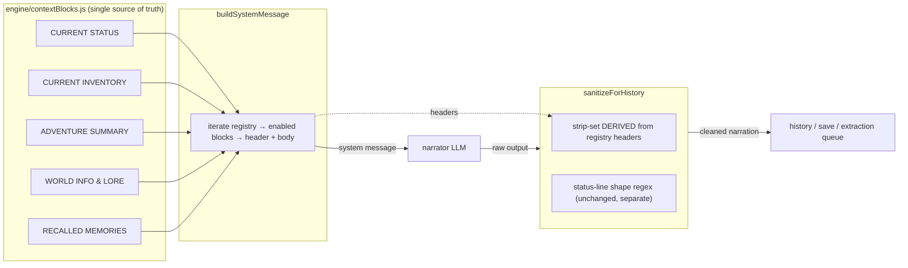

## Context

The narrator's system message is composed by `LlmOrchestrator.buildSystemMessage` (`engine/llm.js:297-339`) through sequential `systemContent +=` appends of named blocks: `[CURRENT STATUS]`, `[CURRENT INVENTORY]`, `[ADVENTURE SUMMARY]`, `[WORLD INFO & LORE]`, `[RECALLED MEMORIES]`. `sanitizeForHistory` (`engine/llm.js:137-191`) strips echoed context by matching a hardcoded header regex (`engine/llm.js:156`) covering only the two `CURRENT` blocks, plus a separate status-line shape regex.

Two problems follow:
1. **Coupling gap** — composition and sanitization are two independent lists that must be manually kept in sync. The strip-set is already behind: `[ADVENTURE SUMMARY]`, `[WORLD INFO & LORE]`, `[RECALLED MEMORIES]` are injected but not strip-eligible.
2. **Feature drag** — the follow-up spatial-map feature needs new injected blocks; landing them on today's seam means two more two-place edits and another injection surface.

The status-line machinery is deliberately untouched by this change: `STATUS_FORMAT` (`engine/statusFormat.js`), the status-line shape regex, the mock two-field line, and the frontend status literal are all pinned contracts this change preserves.

## System Architecture Diagram



The registry feeds both directions: composition (block → prompt) and sanitization (header → strip-set). The status-line regex stays independent so block work never touches status-line handling.

## Goals / Non-Goals

**Goals:**
- One declarative registry that is the single source of truth for narrator context blocks.
- Sanitizer strip-set derived from the registry, closing the coupling gap and the three existing leaks.
- `[CURRENT STATUS]` renders byte-identically; status-line contract untouched.
- Preserve gating (blocks only injected when relevant).

**Non-Goals:**
- No change to `STATUS_FORMAT`, the status-line shape regex, mock output, or the frontend prompt literal.
- No new prompt blocks in this change (the spatial-map feature adds them later against this registry).
- No session versioning, no undo changes, no room/graph data — those belong to the follow-up feature change.
- No new dependencies.

## Decisions

### D1. A plain module registry, not a framework
The registry is a static array of block descriptors in `engine/contextBlocks.js`:

```js
export const CONTEXT_BLOCKS = [
  { header: "CURRENT STATUS",
    enabled: () => true,
    build: (state) =>
      `- Location: ${state.location}\n- Score: ${state.score}\n- Moves: ${state.moves}` },
  { header: "CURRENT INVENTORY",
    enabled: (state, { inventoryItems }) => inventoryItems != null,
    build: (state, { inventoryItems }) => inventoryItems?.length
      ? inventoryItems.map(...).join('\n') : "- (Empty)" },
  // ...ADVENTURE SUMMARY / WORLD INFO & LORE / RECALLED MEMORIES
];
```

Rationale: the block shape is simple (header + bullets), and a framework adds a dependency for ~40 lines of string composition. This matches the house single-source pattern (`statusFormat.js`, `itemNames.js`). The `enabled` predicates replicate the existing conditional appends so gating behavior is preserved exactly. **Alternative rejected:** a templating package (handlebars/ejs) — new dependency, no payoff at this scale.

### D2. `buildSystemMessage` composes from the registry
The current ad-hoc appends collapse into one loop:

```js
buildSystemMessage(state, activeCards, ragMemories, inventoryItems) {
  const turnContext = { activeCards, ragMemories, inventoryItems };
  let content = state.systemPrompt;
  content += PLAYER_INPUT_FRAMING;                 // unchanged, not a block
  for (const block of CONTEXT_BLOCKS) {
    if (block.enabled(state, turnContext)) {
      content += `\n\n[${block.header}]\n${block.build(state, turnContext)}`;
    }
  }
  return { role: "system", content };
}
```

The `[PLAYER INPUT]` framing stays a hardcoded prefix (it is instruction framing, not state context, and must always be present). Rationale: keeping the loop dumb means a future block is one array entry. **Alternative rejected:** composing blocks in callers or per-feature modules — reintroduces the two-place sync problem.

### D3. Sanitizer strip-set derived from registry headers
`sanitizeForHistory` builds its block-strip pattern from the registry headers once (module load) and strips any registered block shape (header line + following `- ` bullets, tolerating a `> ` role-play prefix — the existing shape logic from `engine/llm.js:158-185`). Rationale: a registered header is by definition something the narrator saw, hence something it may echo; making strip-eligibility a property of registration is the coupling fix. This is what closes the three existing leaks.

### D4. `[CURRENT STATUS]` byte-identical output
The `CURRENT STATUS` block builder emits exactly `- Location: …\n- Score: …\n- Moves: …`, and block emission uses the same `\n\n[HEADER]\n` framing as today, so the composed message for identical inputs is byte-identical. Rationale: the pinned status contract and the frontend literal (source-text test) depend on it. Guarded by a dedicated contract test.

### D5. Sanitizer list no longer hand-maintained
The `[CURRENT STATUS]`/`[CURRENT INVENTORY]` regex alternation is deleted; the status-line shape regex remains (different machinery, covers `[Status: …]` lines, not blocks). Rationale: keeping the two mechanisms (block vs status-line) visually separate prevents future confusion about which strip rule applies.

## Risks / Trade-offs

- **[Regression] Widening the strip-set could strip legitimate narration that happens to contain a registered block header.** → The existing block-stripper already requires the exact block shape (header line + following `- ` bullets); prose that merely contains the tokens is untouched. The `test_injection_defense.py` suite is the regression gate.
- **[Contract drift] A rewritten `[CURRENT STATUS]` could change byte output.** → Dedicated contract test asserting exact `CURRENT STATUS` block text and overall composed-message equivalence for a fixed state snapshot.
- **[Edge] Blocks with non-bullet bodies (future) won't strip cleanly.** → Current strip logic only consumes bullet lines after the header; if a future block uses prose bodies, the sanitizer's block parser must be extended in the same change that adds the block. Documented in tasks.
- **[Behavioral] Reordering blocks in the composed message could subtly shift narration.** → Gating and order are preserved from today's append order; no reorder is introduced by this change.

## Migration Plan

- Deploy as one commit: add `engine/contextBlocks.js`, rewire `buildSystemMessage` and `sanitizeForHistory`, keep mock and frontend untouched.
- Rollback: revert the commit; the previous hardcoded composition and strip-set are fully restored (no data migration, no format change).
- The save-file format and API payloads are unaffected, so this change is invisible to existing sessions.

## Open Questions

- Whether `[PLAYER INPUT]` framing should eventually join the registry as an "always-on" block. Left out for now because it is instruction framing with no strip-eligibility need; trivial to add later if it becomes configurable.
