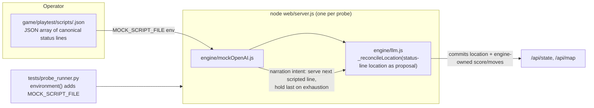

## Context

`engine/mockOpenAI.js` serves a hardcoded `[Status: Cantina]` narration on every turn (`mockOpenAI.js:37`). Spatial reconciliation reads the status-line location as a proposal (`engine/llm.js:362`), so against the default mock the graph never grows past one room. The proven scripted-narrator pattern lives in `tests/unit/spatialIntegration.test.mjs` but only works in-process (monkey-patching the client); probes drive an HTTP server and cannot monkey-patch its in-process client. This change moves scripted narration into the mock module, gated behind `MOCK_SCRIPT_FILE`, so HTTP-driven probe servers can vary their narrator without a real model.

The change is deliberately small and additive: one env-gated branch in the mock's `narration` intent, plus a `MOCK_SCRIPT_FILE` passthrough in the probe runner's environment builder.

## System Architecture Diagram

Flow: the operator places a script file; the runner passes `MOCK_SCRIPT_FILE` into the probe server's env; the mock's `narration` intent serves lines from the script (or canned narration when unset); the engine reconciles the status-line location and commits engine-owned score/moves.

## Goals / Non-Goals

**Goals:**
- Mock narration becomes scriptable via `MOCK_SCRIPT_FILE` so spatial (and future) missions can run mock-only.
- Default path is byte-identical — zero impact on existing mock tests and status-contract suites.
- The change lives in the mock module (narration content's home), not the HTTP layer.
- Probe runner passes the env var through so probes can point at their own script.

**Non-Goals:**
- Scripting intents beyond `narration` (opening_scene/suggestion keep canned behavior).
- An HTTP control endpoint for mid-run mock adaptation (rejected — test-only HTTP surface).
- Folding into `probe-runner-parallel-playtest` (complete/verified) or `spatial-map-region-graph` (unimplemented WIP — this is the capability that change's sweep will consume).
- Running the spatial 7-mission fan-out (out of scope; waits on the feature).

## Decisions

**D1: `MOCK_SCRIPT_FILE` env var + JSON array of status lines.** Minimal, additive, lives where narration content belongs. Each element is a full canonical status line, so the parser contract is preserved and the mock can wrap it in a prose-free chunked stream. Alternative (per-intent script object) rejected for v1 — only narration needs scripting.

**D2: Script state held on the mock instance (or module), index advances per narration call; hold last on exhaustion.** Mirrors `spatialIntegration.test.mjs` (`narrations[Math.min(idx, len-1)]`). Deterministic and matches the proven test. Read the file lazily on first narration use (or at construction) — implementation detail; lazily at first narration avoids failing startup for a bad path.

**D3: Reuse the existing chunked generation shape.** The scripted narration should be served through the same streaming path consumers already parse (`chunk`/`done` frames with the trailing status line), so `parseStatusLine` and history sanitization behave identically. The script provides the status line; the mock wraps it in the canonical stream shape.

**D4: Fall back to canned narration on unreadable/missing/invalid script.** A bad `MOCK_SCRIPT_FILE` must not crash the server or a probe run — deterministic fallback (canned) with a clear warning. This keeps the "additive/opt-in" property airtight.

**D5: Runner passthrough only.** `tests/probe_runner.py` `environment()` adds `MOCK_SCRIPT_FILE` from an option if supplied; it does NOT invent defaults or require the file to exist at runner startup. Probes that don't set it behave exactly as before.

## Risks / Trade-offs

- [Scripted `Score`/`Moves` fields could be mistaken for engine values] → The engine is the single owner (existing invariant); the spec pins engine-owned commit; a test asserts committed score/moves match `GET /api/state`, not the script.
- [Bad `MOCK_SCRIPT_FILE` path crashes a probe run] → D4 fallback to canned narration + warning; server keeps running.
- [Script exhaustion semantics drift from the proven test] → D2 pins "hold last"; the smoke test asserts it.
- [`mockOpenAI.js` is shared by all mock consumers] → The env gate is strictly opt-in; default branch untouched; status-contract suites re-run green with the env unset.
- [This capability could be mistaken as unblocking the spatial fan-out] → Non-goal; `spatial-map-region-graph` is 0 tasks done (uncommitted WIP). This change only provides the mock mechanism.

## Migration Plan

- Land as a standalone small change. No data, schema, or save-format migration.
- Rollback: revert `mockOpenAI.js` + the runner env line; default behavior never depended on the new path.
- Consumers adopt incrementally: a spatial probe sets `MOCK_SCRIPT_FILE=game/playtest/scripts/<probe>.json` (gitignored dir) when the feature lands.

## Open Questions

- Read the script lazily at first narration vs at `MockOpenAI` construction — lazily-at-first-use is preferred (keeps startup robust), but the exact point is an implementation detail.
- Whether `Score`/`Moves` in scripted lines should be stripped or left advisory — left advisory (engine owns them); a test pins it either way.
