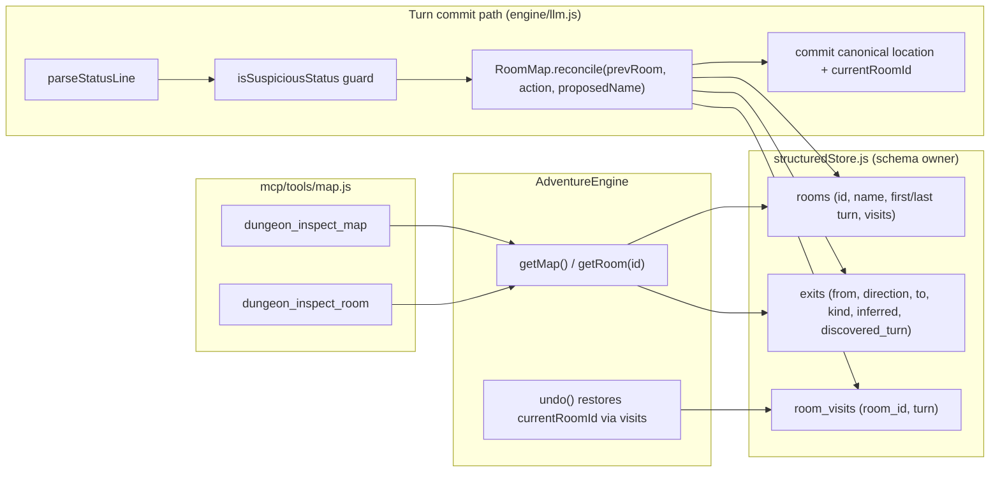

## Context

`location` is committed from the narrator's status line at `engine/llm.js:610-612` after the forged-status guard, into a plain string field on `AdventureState` persisted in the save JSON. There is no identity, no topology, and no undo handling for it (`engine.undo` never restores `location`). The memory layer already has the architectural template this needs: `structuredStore.js` owns all tables + guarded migrations + full-surface `rollbackTurn`; the barter engine is a thin state machine over it; the engine exposes proxies; the narrator is advisory and the engine is authoritative.

This change builds a **persisted room graph** on that exact pattern. It depends on the `structured-narrator-context` change having landed (registry-derived prompt composition + sanitizer), because v1's prompt blocks are phase 2 — but the registry seam is where they will land, and nothing in this change should re-introduce ad-hoc prompt composition.

## System Architecture Diagram



## Goals / Non-Goals

**Goals:**
- A deterministic, persisted room graph per adventure (rooms, exits, visits).
- Per-turn reconciliation that is engine-authoritative on identity, never blocks movement, never fabricates connectivity.
- Reverse inference for reversible directions; portal/time edge kinds without reverse.
- Undo restores the pre-turn room; rollback removes the undone turn's spatial rows.
- Pure, unit-testable reconciliation; MCP inspection tools with read-through freshness.

**Non-Goals:**
- No fuzzy/vector name matching (phase 2; v1 uses exact canonical matching).
- No `dungeon_path_to`, `dungeon_navigate`, frontend map render, items/NPC tracking, or temporal re-anchor prompt twist (phase 2+).
- No new prompt blocks (phase 2 — the `structured-narrator-context` registry is where they land).
- No session versioning in adventure IDs.
- No retrofit of `events.location` / `inventory.acquired_at` to room ids.
- No new dependencies.

## Decisions

### D1. Schema-owner pattern: tables live in `structuredStore.js`
`rooms`, `exits`, and `room_visits` are declared in `_initSchema` and accessed through store methods (`upsertRoom`, `getRoom`, `getRooms`, `recordVisit`, `recordEdge`, `getExits`, `rollbackTurn` extension), exactly as `barter_offers`/`quest_goals` are. Rationale: preserves the `memory-schema-boundary` invariant that a single module owns schema and rollback. **Alternative rejected:** a separate store/module owning the room tables — would fragment the rollback surface and schema authority.

Schema shape:

```sql
CREATE TABLE IF NOT EXISTS rooms (
  id          TEXT PRIMARY KEY,
  adventure_id TEXT NOT NULL,
  name        TEXT NOT NULL,      -- canonical display name
  description TEXT,               -- optional, phase-2 re-anchor
  first_turn  INTEGER NOT NULL,
  last_visit_turn INTEGER,
  visit_count INTEGER DEFAULT 0
);
CREATE TABLE IF NOT EXISTS exits (
  id            TEXT PRIMARY KEY,
  adventure_id  TEXT NOT NULL,
  from_room     TEXT NOT NULL,
  direction     TEXT NOT NULL,    -- label (cardinal or mechanism label)
  to_room       TEXT NOT NULL,
  kind          TEXT DEFAULT 'walk',   -- 'walk' | 'portal' | 'time'
  inferred      INTEGER DEFAULT 0,
  discovered_turn INTEGER,
  UNIQUE(adventure_id, from_room, direction)
);
CREATE TABLE IF NOT EXISTS room_visits (
  id          TEXT PRIMARY KEY,
  adventure_id TEXT NOT NULL,
  room_id     TEXT NOT NULL,
  turn        INTEGER NOT NULL
);
```

`UNIQUE(adventure_id, from_room, direction)` — one edge per direction per room. This is what makes re-traversal deterministic and contradiction detectable. The `turn_index`-style rollback guard: rooms carry `first_turn`, exits carry `discovered_turn`, visits carry `turn`; rollback deletes rows with `>= N`.

### D2. `RoomMap` is a pure reconciliation module (`engine/memory/roomMap.js`)
It exports pure functions — `classifyTransition(actionText)`, `directionFromAction(actionText)`, `normalizeRoomName` / `roomNamesMatch` (stem-aware, same regime as `itemNamesMatch`), and the decision function `reconcile(prevRoomId, actionText, proposedName, ctx)` where `ctx` exposes the store lookups (getRoom, getExits, upsert…). The decision logic is unit-testable without an LLM, mirroring `scoring.js` / `parseStatusLine`. The turn path calls it; the MCP tools call the store through engine proxies.

### D3. Reconciliation decision table
Given `prevRoom`, `actionText`, `proposedName`, with `kind = classifyTransition(actionText)`:

```
kind = 'walk', dir = directionFromAction(actionText), edge = exits(prev, dir)
  edge exists, inferred=0:
      proposedName ≈ target → adopt target
      else              → adopt target (canonicalize name, log drift)   [first visit wins]
  edge exists, inferred=1:
      proposedName ≈ target → adopt target
      else              → RETRACT inferred edge, grow new edge/room      [self-heal]
  no edge, proposedName matches known room → add walk edge to it
  no edge, no match                        → new room + walk edge
  → if direction reversible: also add inferred reverse edge

kind = 'portal': resolve target; record portal edge (mechanism label as
  direction), NO reverse, NO inference.
kind = 'time':   resolve target; record time edge, NO reverse.          [state-mutating]
kind = 'unknown': resolve target; NO edge at all.                       [never fabricate]
```

Every path resolves through `resolve(proposedName)` → known room or new room. Failure-mode acceptance (research): same place, different name → duplicate node/region in v1.

### D4. `currentRoomId` on state, additive save format
`AdventureState` gains `currentRoomId = null`; save JSON writes it; load tolerates a missing field (old saves keep `location` as the display name). `location` remains the canonical display name — the two must stay in sync (resolver sets both). **Decision:** store the id, resolve the display name from the store on read; keep `state.location` as the committed name for compatibility with the status contract and frontend.

### D5. Undo restores the room via the visits trail
`engine.undo` records the room before the undone turn (from the last `room_visits` row at or before `preUndoMoves - 1`, or the room at the turn start captured in the turn-commit path). After `rollbackTurns(preUndoMoves)` removes the undone turn's rows, undo sets `state.currentRoomId` / `state.location` to that pre-turn room. Rationale: `AdventureState.undo()` alone cannot know the previous room; the visits table is the authoritative trail and doubles as the re-anchor staleness source (phase 2). This is the existing-gap fix (undo never restored location).

### D6. Stamping index = `state.moves`
Spatial rows are stamped with the turn's `moves` value — the same index `bufferTurnPair` uses after the increment (`engine/llm.js:613, 646-652`). The resolver runs after `state.moves += 1` so its rows roll back with the same `>= N` sweep as extraction.

### D7. MCP tools reuse the shared freshness helper
`mcp/tools/map.js` imports the existing `forceFlushBeforeRead` from `mcp/tools/memory.js`; both tools are thin reads over `engine.getMap()` / `engine.getRoom(id)`. No per-tool flush ceremony.

### D8. No new prompt blocks in v1
The canonical location already flows back to the narrator via `[CURRENT STATUS]` next turn, which self-corrects prose drift. `[MAP CONTEXT]` / re-entry anchors are phase 2 and land on the `structured-narrator-context` registry as one declarative block each — with no sanitizer edits, per that change's guarantee.

## Risks / Trade-offs

- **[Soft spot] Exact name matching causes duplicate nodes/regions for paraphrased room names.** → Accepted for v1 and documented; fuzzy/vector matching is the phase-2 mitigation.
- **[Hot path] Store writes every turn could add latency.** → better-sqlite3 is synchronous and micro-fast (a few upserts); the resolver degrades to "keep proposed location + log" on write failure, so a store problem can never kill a turn.
- **[Undo ordering] Restoring `currentRoomId` must happen after rollback, not before.** → `engine.undo` sequence: snapshot pre-turn room → `rollbackTurns(preUndoMoves)` → set `currentRoomId`/`location` → save. Tested explicitly.
- **[Contract] Committing a canonical location that differs from the narrator's prose** (re-traversal drift). → Accepted: status is authoritative, prose is prose; phase-2 re-anchor pulls prose back into alignment.
- **[Migration] Existing saves lack `currentRoomId`.** → Additive field with `null` default; first turn after load reconciles and establishes the current room from `location`.
- **[Interplay] The event extractor's `location`-type lore cards overlap with the room registry.** → v1 does not unify them; rooms own identity, lore cards keep their existing context role. A future change may link via `room_id`.

## Migration Plan

- Deploy in one commit (after `structured-narrator-context`): new tables auto-created by `_initSchema` (`CREATE TABLE IF NOT EXISTS`), `currentRoomId` additive on save, `rollbackTurn` extended.
- Rollback: revert the commit; the previous blind location commit and JSON save shape are fully restored. New tables are harmless orphans if the commit is reverted before use.
- Old sessions load unchanged; their map fills in from the first turn after the upgrade.

## Open Questions

- Whether `GET /api/map` should be a new endpoint or fold into `GET /api/state` for v1 (MCP tools are the required surface; the web endpoint is minimal/optional).
- Whether room descriptions should be captured from first-visit narration in v1 or left to the phase-2 lore link. Default: leave to phase 2.
