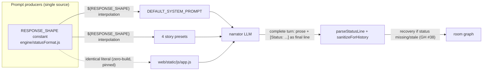

## Context

The narrator's system prompt already carries a status-format contract (`STATUS_FORMAT`), a status mandate, and a style directive (all from `narrator-style-fidelity`). But live playtests show the narrator still drops, truncates, or mangles the status line and occasionally emits off-shape turns (meta text, trailing questions) — because the prompt's examples teach only the status *format*, not the full response anatomy. This change adds a `RESPONSE SHAPE` exemplar — three complete-turn examples — to the prompt so the narrator imitates a well-formed turn instead of inferring one. The recovery backstop (GH #38) remains the safety net, so examples are a compliance lever, not a correctness requirement.

## System Architecture Diagram

## Goals / Non-Goals

**Goals:**
- Give the narrator complete-turn examples (prose + final status line) across the exploring / dialogue / simple-action turn types, so it never has to infer the response shape.
- Single source of truth: one `RESPONSE_SHAPE` constant drives all five prompt producers; the frontend declares the identical literal, held honest by source-text pins.
- Keep the examples tone-neutral and grounded (no item references the scene never establishes), so they do not bias the default narrator's style or teach hallucination.

**Non-Goals:**
- No engine-logic change: `parseStatusLine`, reconciliation, the forged-status guard, and the recovery backstop are untouched.
- No change to the `[NARRATOR STYLE]` style mechanism, the block registry, or the sanitizer.
- Not a "mobile narrator" decision, and not a spatial-mechanics lesson (movement agreement appears in the examples only incidentally).
- No new dependencies.

## Decisions

### D1. Examples over more prose rules
Models imitate examples more reliably than prose rules. The mandate ("Location MUST name the new place") already exists as prose; the missing lever is demonstration. Complete-turn examples are the strongest available prompt signal. **Alternative rejected:** a second LLM repair pass for malformed turns — latency + cost, and recovery already backstops missing status lines deterministically.

### D2. One shared constant, not five hardcoded copies
`RESPONSE_SHAPE` lives beside `STATUS_FORMAT` in `engine/statusFormat.js`; the default prompt and presets interpolate `${RESPONSE_SHAPE}`; `app.js` inlines the identical literal. This is the existing `STATUS_FORMAT` pattern — a single edit cannot silently drift any producer. **Alternative rejected:** hardcoding into all five sources, which is exactly the duplication that caused the mandate/directive to need a five-way sync.

### D3. Replace the Zork examples (v1), keep them recoverable
The three existing examples (`open mailbox` / `take leaflet` / `go north`) teach only the status format; `RESPONSE_SHAPE` is a superset (format + full anatomy). Keeping both would duplicate the teaching and add ~100 tokens per turn to every system message. **Risk:** losing the "curt Zork" baseline — mitigated because the persona rules already state it in prose; reversible by restoring the old examples from git. (Peer flagged the whole block for review as potentially over-restrictive — GH #41.)

### D4. Tone-neutral examples
The examples deliberately do not lean whimsical/grim/terse/etc. The per-session `[NARRATOR STYLE]` block is what pins tone; a tone-biased static example would leak that tone into the default narrator *before* the style pin applies. **Alternative rejected:** showing one example per tone — triples the block for no contract value.

## Risks / Trade-offs

- **[Over-restrictive / prompt bloat]** The block constrains output and adds tokens to every turn → The peer flagged review (GH #41); the block is a handful of lines; examples are the highest-leverage prompt signal. If compliance does not improve, the recovery backstop still keeps the map correct.
- **[Example imitation]** Models occasionally echo example names/locations into unrelated turns → The `[CURRENT STATUS]` block provides the real current location, which dominates; the existing "West of House" examples have not leaked in playtests.
- **[Contract drift]** Touching all five prompt sources risks the pinned literals → Source-text pins assert the `RESPONSE SHAPE` marker and the "final line" rule across all five producers.
- **[Style bleed]** Replacing the Zork examples could shift the default register → Tone-neutral examples + prose persona rules; measurable via a short live session.

## Migration Plan

- Deploy as one commit: add `RESPONSE_SHAPE` to `engine/statusFormat.js`, swap the inline examples for `${RESPONSE_SHAPE}` in `DEFAULT_SYSTEM_PROMPT` and the four presets, update the `app.js` literal, extend the source-text pins, run unit + pytest.
- Rollback: revert the commit; the previous prompts and constants are fully restored (no data migration).
- Existing sessions load unchanged; the new prompt text only affects future turns.

## Open Questions

- Whether the drafted `RESPONSE_SHAPE` block is too restrictive for real narrators — tracked as a review issue (GH #41); verify with one natural live session after implementation.
- Whether the examples measurably improve status-line compliance on the default model — measurable by comparing usable-status-line counts before/after in a live session.
