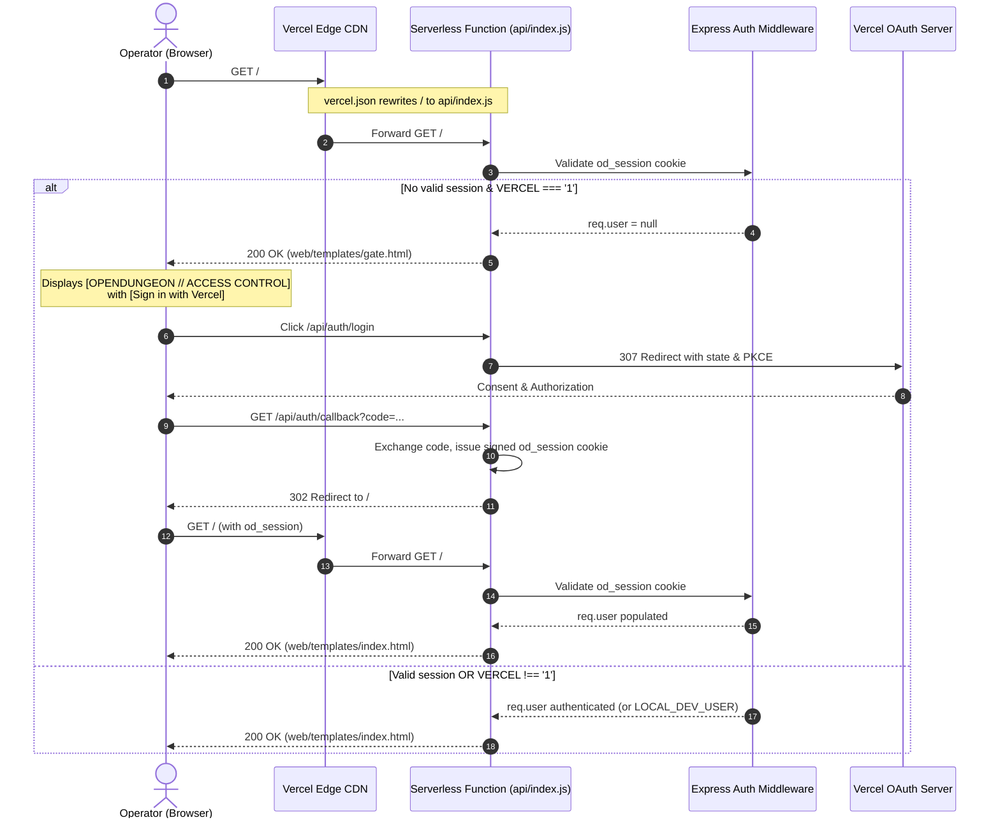

## Context

In production on Vercel, OpenDungeon was originally configured in `vercel.json` with a static CDN rewrite `{ "source": "/", "destination": "/web/templates/index.html" }`. This bypassed the Express application layer completely on root navigation, serving the simulation startup menu, narrative presets, and UI controls directly to unauthenticated visitors.

To protect the application surface, prevent unauthorized game initialization, and ensure operators authenticate before accessing game controls, root route navigation (`GET /`) must be routed through the Express application. On Vercel, requests lacking an authenticated session cookie will be served a specialized retro-terminal access gate (`gate.html`) providing an explicit "Sign in with Vercel" trigger, while authenticated users (and local development environments) receive the full simulation interface (`index.html`).

## System Architecture Diagram

## Goals / Non-Goals

**Goals:**
- **Server-Enforced Access Barrier**: Ensure unauthenticated requests to `/` in production cannot access or view the simulation startup UI, narrative presets, or game controls.
- **Dedicated Retro-Terminal Gate Screen**: Provide an on-theme retro-terminal gate screen (`gate.html`) with an explicit "Sign in with Vercel" button and error notification banner when `?auth_error=` is present.
- **Zero Redirect Loops**: Avoid direct HTTP 302 redirect loops between `/` and `/api/auth/login` if session cookies fail to persist or browser privacy blocks third-party cookie handling.
- **Preserve Local Developer Experience**: Allow local development (`VERCEL !== '1'`) to continue seamlessly via `LOCAL_DEV_USER` fallback without requiring internet connectivity or Vercel OAuth credentials.
- **Static Asset Caching**: Maintain high-performance edge caching on Vercel CDN for static assets (`/static/*`).

**Non-Goals:**
- Modifying session storage mechanism (HMAC-SHA256 stateless cookies continue to be used).
- Adding multi-provider OAuth (only Vercel OAuth is targeted).
- Restricting public documentation or static CSS/JS assets from Edge CDN caching.

## Decisions

### 1. Retro-Terminal Access Gate Screen (Option B) vs. Direct Redirect (Option A) vs. Client-Side Modal (Option C)
- **Decision**: Serve `web/templates/gate.html` with status 200 at `GET /` when unauthenticated on Vercel.
- **Rationale**:
  - *Option A (Direct 302 redirect to `/api/auth/login`)*: Highly prone to infinite redirect loops if cookie issuance fails or browser settings reject cookies. It also causes jarring auto-redirects on first visit.
  - *Option C (Client-side modal overlay)*: Insecure because the underlying HTML, presets, scripts, and simulation state DOM elements are still delivered to the client and can be revealed by modifying DOM styles.
  - *Option B (Dedicated Gate Screen)*: Securely terminates at the server level, preventing `index.html` from being delivered to the client at all, while maintaining terminal immersion and safe error handling.

### 2. Vercel Function Packaging (`includeFiles`)
- **Decision**: Configure `"includeFiles": "web/templates/**"` inside `functions["api/index.js"]` in `vercel.json`.
- **Rationale**: Serverless lambdas in Vercel do not bundle filesystem files outside the dependency graph by default. Express routes calling `res.sendFile(path.join(__dirname, 'templates', ...))` require the HTML templates to be physically present in `/var/task/web/templates/`.

### 3. Route Rewrites in `vercel.json`
- **Decision**: Update rewrite rules in `vercel.json` to route `/` to `/api/index.js` while keeping `/static/(.*)` routed to `/web/static/$1`.
- **Rationale**: Static assets (fonts, icons, styles) should remain served directly from Vercel's global CDN cache without invoking serverless functions, saving execution time and invocation costs.

## Risks / Trade-offs

- **[Risk] Missing template files in serverless bundle causing 500 FUNCTION_INVOCATION_FAILED**:
  - *Mitigation*: Specify `"includeFiles": "web/templates/**"` in `vercel.json` and verify in unit test mocks that `sendFile` resolves against `path.join(__dirname, 'templates', ...)`.
- **[Risk] OAuth redirect loops or cookie blockages**:
  - *Mitigation*: The gate screen requires an explicit user click on `[ Sign in with Vercel ]`. If authentication fails or is rejected, the user is redirected to `/?auth_error=oauth_failed`, where `gate.html` displays an explanatory message without automatically redirecting.
- **[Risk] Local test suite disruption**:
  - *Mitigation*: Route gating is conditional on `config.isVercel`. In test/local environments, `req.user` defaults to `LOCAL_DEV_USER` unless testing Vercel mode with an explicitly configured test app.

## Migration Plan

1. Create `web/templates/gate.html` matching existing terminal styling and phosphor CRT aesthetic.
2. Update `web/server.js` `GET /` handler to inspect `cfg.isVercel && !req.user` and serve `gate.html` or `index.html`.
3. Update `vercel.json` with `includeFiles` and `/` rewrite to `/api/index.js`.
4. Add comprehensive unit tests in `tests/unit/vercelEntry.test.mjs`.
5. Deploy to Vercel and verify `/` renders the access gate for anonymous users and `index.html` once logged in.

## Open Questions

- *None*: The authentication flow, styling approach, and configuration keys are fully established from research and prototype verification.
