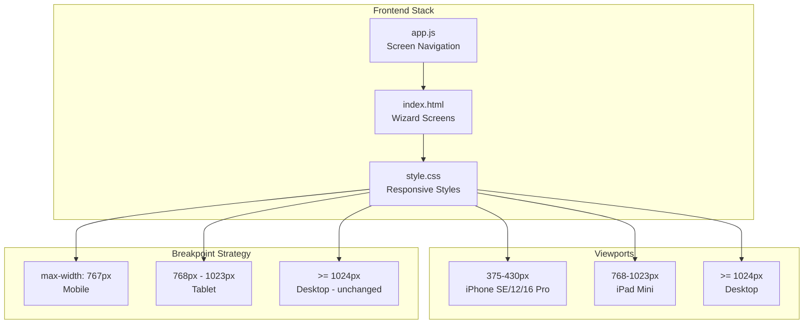

## Context

Open Dungeon is a browser-based text adventure game with a retro terminal aesthetic. The frontend is vanilla JS with no build step, using native ESM modules. The UI consists of wizard screens (startup, preset selection, character selection, custom configuration) followed by a gameplay screen with console output.

Current state: The wizard screens were designed desktop-first with only minor mobile adjustments (padding, font-size). The single mobile breakpoint at 767px applies minimal tweaks. Modals have no responsive styles. Console fonts are inconsistent across turn types.

Constraints:
- No build step — CSS must be vanilla, no preprocessors
- Must preserve desktop experience (>= 1024px) completely
- Must work on viewports from 375px (iPhone SE) to 1024px+ (iPad Pro, desktop)
- Touch targets must meet 44x44px minimum for mobile usability
- Safe-area insets required for notched devices (iPhone 12/13/16 Pro)

## System Architecture Diagram

## Goals / Non-Goals

**Goals:**
- Make all wizard screens (startup, preset, character, custom-preset) fully usable on mobile viewports (375px+)
- Ensure all buttons and interactive elements meet 44x44px touch target minimum
- Add responsive styles for all modals (barter, system prompt, lore, confirmation)
- Standardize console font sizes across all turn types (user, assistant, system)
- Support safe-area insets for notched devices
- Add tablet breakpoint (768-1023px) with 2-column grid layouts
- Preserve desktop experience completely unchanged

**Non-Goals:**
- Floating debug panel (separate feature, out of scope)
- Touch gestures (swipe, pinch) — button navigation is sufficient
- Carousel/slider components — stacked cards are simpler and more accessible
- Backend changes — all changes are frontend-only
- Browser support below iOS 11.2 (no safe-area-inset support)

## Decisions

### 1. Mobile-First Wizard Screen Layout

**Decision**: Redesign wizard screens as full-height viewport layouts with scrollable content and pinned CTAs.

**Rationale**: 
- Desktop-first approach with media query overrides leads to cramped layouts on mobile
- Full-height viewport ensures content uses available space efficiently
- Pinned CTAs (footer buttons) remain accessible without scrolling back to bottom
- Alternative considered: Single-page app with route-based navigation — rejected as too invasive for this change

**Implementation**:
- Each wizard screen gets `min-height: 100vh` on mobile
- Content area gets `overflow-y: auto` with padding for safe areas
- Footer navigation gets `position: sticky; bottom: 0` or fixed positioning
- Safe-area insets applied via `padding-bottom: env(safe-area-inset-bottom)`

### 2. Breakpoint Strategy

**Decision**: Use two breakpoints — 767px (mobile) and 768-1023px (tablet).

**Rationale**:
- 767px captures all phones (iPhone SE at 375px to iPhone 16 Pro at 430px)
- 768-1023px captures tablets (iPad Mini at 768px to iPad Pro at 1024px)
- >= 1024px remains desktop (unchanged)
- Alternative considered: Single breakpoint at 768px — rejected because tablet layout needs 2-column grids which don't work on phones

**Implementation**:
- `@media (max-width: 767px)` — mobile styles (single column, stacked buttons)
- `@media (max-width: 1023px) and (min-width: 768px)` — tablet styles (2-column grids)
- Desktop styles (>= 1024px) remain in base CSS, no media query

### 3. Grid Layout Strategy

**Decision**: Replace `auto-fit, minmax(220px, 1fr)` with explicit column counts per breakpoint.

**Rationale**:
- `auto-fit` creates single column on mobile but cards are too wide (355px on 375px screen)
- Explicit `1fr` on mobile ensures cards stack vertically with proper padding
- Explicit `repeat(2, 1fr)` on tablet provides 2-column layout
- Alternative considered: CSS Grid `auto-fit` with smaller `minmax` value (e.g., 150px) — rejected because it creates unpredictable column counts

**Implementation**:
- Mobile: `.preset-grid, .character-grid { grid-template-columns: 1fr; }`
- Tablet: `.preset-grid, .character-grid { grid-template-columns: repeat(2, 1fr); }`
- Desktop: `.preset-grid, .character-grid { grid-template-columns: repeat(auto-fit, minmax(220px, 1fr)); }` (unchanged)

### 4. Modal Responsiveness

**Decision**: Add mobile-specific modal styles with vertical stacking and scrollable content.

**Rationale**:
- Barter modal's 3-column grid (`1fr auto 1fr`) breaks on mobile
- System prompt modal textarea overflows on small screens
- All modals need `max-width: 90vw` and `max-height: 90vh` with scrolling
- Alternative considered: Bottom-sheet pattern for all modals — rejected as too invasive, vertical stacking is simpler

**Implementation**:
- `.modal-content { max-width: 90vw; max-height: 90vh; overflow-y: auto; }` on mobile
- `.barter-layout { grid-template-columns: 1fr; }` on mobile (stacks vertically)
- `.barter-arrow { display: none; }` on mobile (arrow not needed in vertical layout)
- Modal buttons stack vertically or wrap with `flex-wrap: wrap`

### 5. Console Font Consistency

**Decision**: Remove explicit `font-size` overrides on `.log-turn-assistant` and `.log-turn-system`, standardize base to 0.85rem.

**Rationale**:
- Inconsistent font sizes (0.95rem user, 1.05rem assistant, 0.85rem system) create uneven reading experience
- All three are console log entries — no semantic reason for size differences
- 0.85rem is already used on mobile, standardizing across all viewports simplifies CSS
- Alternative considered: Keep size differences but reduce them — rejected as unnecessary complexity

**Implementation**:
- Remove `font-size: 1.05rem` from `.log-turn-assistant`
- Remove `font-size: 0.85rem` from `.log-turn-system`
- Change `.console-log { font-size: 0.85rem; }` (desktop) to match mobile
- All turn types inherit from `.console-log`

### 6. Touch Target Sizing

**Decision**: Enforce 44x44px minimum on all interactive elements via CSS.

**Rationale**:
- Apple HIG and WCAG recommend 44x44px minimum for touch targets
- Current buttons have varying sizes, some below 44px
- Using `min-height: 44px` and `min-width: 44px` ensures tappable area
- Alternative considered: Increase padding to achieve 44px — rejected as it changes visual spacing unpredictably

**Implementation**:
- `.btn, .preset-card, .char-card, .mobile-tab { min-height: 44px; }`
- Form inputs: `input, textarea, select { min-height: 44px; }`
- Modal close button: `.btn-close { min-width: 44px; min-height: 44px; }`

### 7. Safe-Area Insets

**Decision**: Apply safe-area insets via CSS `env()` function.

**Rationale**:
- Notched devices (iPhone 12/13/16 Pro) have unsafe areas at top/bottom
- `env(safe-area-inset-*)` is the standard CSS approach
- Requires `<meta name="viewport" content="viewport-fit=cover">` in HTML
- Alternative considered: JavaScript-based safe area detection — rejected as CSS is simpler and more performant

**Implementation**:
- Add `viewport-fit=cover` to viewport meta tag in `index.html`
- Apply `padding-top: env(safe-area-inset-top)` to wizard screen headers
- Apply `padding-bottom: env(safe-area-inset-bottom)` to wizard screen footers
- Apply `padding-left: env(safe-area-inset-left)` and `padding-right: env(safe-area-inset-right)` to main container

## Risks / Trade-offs

**[Risk] Breaking desktop layout** → Mitigation: All mobile/tablet styles in media queries, desktop styles unchanged. Regression tests verify desktop layout.

**[Risk] Safe-area insets not supported in older browsers** → Mitigation: `env()` is supported in iOS 11.2+ and all modern browsers. Fallback is no padding (current behavior).

**[Risk] Touch target changes alter visual spacing** → Mitigation: Use `min-height`/`min-width` instead of `height`/`width` to allow larger targets without changing visual size. Review screenshots to verify spacing.

**[Risk] Modal vertical stacking looks awkward on some screens** → Mitigation: Test on all target viewports. If needed, adjust padding/margins. Vertical stacking is standard mobile pattern.

**[Risk] Font size change (0.95rem → 0.85rem) affects readability** → Mitigation: 0.85rem is already used on mobile and is legible. Test on all viewports. Can adjust if needed during implementation.

**[Trade-off] No touch gestures (swipe)** → Acceptable: Button navigation is sufficient for wizard flow. Gestures add complexity without significant UX improvement for this use case.

**[Trade-off] Pinned CTAs reduce vertical space** → Acceptable: Footer buttons are small (44px height). Content area remains scrollable. Trade-off is worth it for accessibility.
