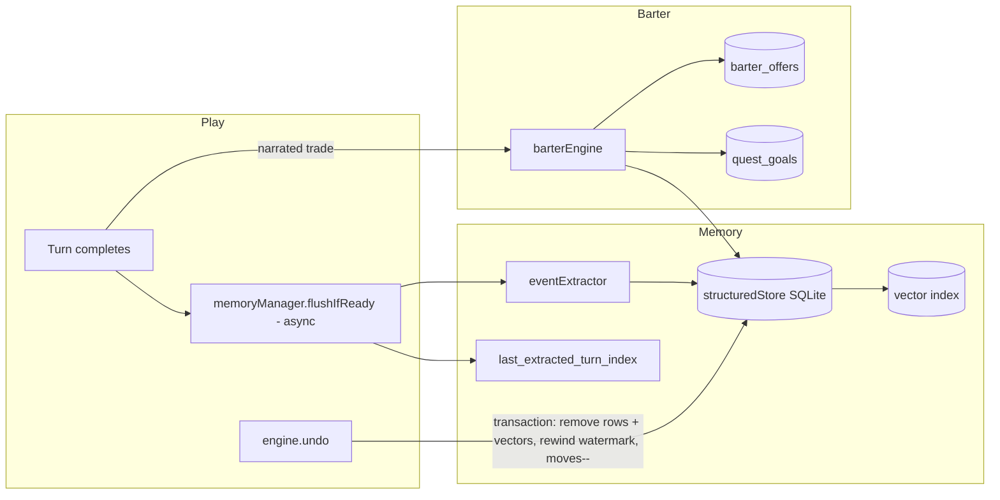

## Context

`engine/index.js:171` (undo) → `engine/state.js:129` reverts only history. The memory layer (`memoryManager`, structured store, vector index) is written by async flush after each turn (`llm.js` background task) and is never rewound. The extractor's output schema (`eventExtractor.js`) covers events + inventory *acquisitions* only — no removal concept. `barterEngine.registerOffer`/`createGoal` each have exactly one HTTP caller (`web/routes/game.js:470,537`); narrative play never reaches `executeBarter`, so trades only add and offers/goals tables stay empty. Live evidence: after a narrated leaflet→gem trade, the trade event was extracted, but `barter_offers` was empty and `dungeon_execute_trade` failed with "No barter offer found"; on undo the event/watermark stayed past history end.

## System Architecture Diagram

## Goals / Non-Goals

**Goals:**
- Undo is atomic across history + store + vector + watermark + moves.
- Narrated trades resolve through `executeBarter` (possession check + atomic swap), closing the duplicate-sale exploit.
- Offers and goals are created from narration, populating the existing tool surface.
- Extraction can express item removal.

**Non-Goals:**
- Not reworking the barter UI/frontend beyond what's needed for offers/goals data.
- Not implementing offer expiry/per-location scoping (#16 explicitly left it open — decision deferred).
- Not the extractor validation/trigger filtering itself (that is `validate-memory-extraction`), though name normalization is shared.

## Decisions

**D1 — Undo as a transaction in `memoryManager` (new `rollbackTurns(turnIndex)`).**
Called from `engine.undo` after history revert. Removes events/inventory/lore rows with `turn_index >= undoneTurn`, deletes their vector ids, and sets `last_extracted_turn_index = undoneTurn - 1`. `moves` decremented by the caller. *Alternative rejected:* full snapshot/restore — heavier and risks divergence; targeted row removal matches the per-turn storage model.

**D2 — Narrated trades route through `executeBarter`.**
When the extractor classifies a trade, invoke `barterEngine.executeBarter` (validate possession, atomic swap) instead of the add-only upsert. This is the single change that fixes both the sold-item-retention and offer-registration gaps. *Alternative:* teaching extraction to remove directly — doesn't validate possession, so it wouldn't close the exploit.

**D3 — Extend the extractor output schema with `offers`, `goals`, and removal-capable inventory changes.**
`inventory_changes[].action` gains `traded` (removal); new top-level `offers`/`goals` arrays feed `registerOffer`/`createGoal`. Reuses the validation from `validate-memory-extraction`. *Risk:* the extractor may over-emit offers/goals → mitigated by validation and by the observed-narration gating in the extraction prompt.

**D4 — Name normalization helper shared with `validate-memory-extraction`.**
One canonical-match helper used by both `executeBarter` lookups and extraction writes, so narrated "Rusty Gear" resolves to stored "Rusted Gear". Coordinate implementation with that change.

## Risks / Trade-offs

- **[D1 undo vs concurrent flush]** → The background flush may be mid-flight during undo. Mitigation: flush (await) before undo, then roll back; document the race in tests.
- **[D2 executeBarter from narration]** → A narrated trade the model describes ambiguously may not map to a held item. Mitigation: possession validation returns a refusal instead of a crash; keep the extractor's fallback.
- **[D3 offer/goal over-emission]** → Extractor could register spurious offers. Mitigation: schema validation (ties to validate-memory-extraction) and a min-confidence/observed-narration gate.
- **[D4 normalization scope]** → Normalizing without migrating legacy rows leaves old drift. Mitigation: normalize on read too (same helper).
