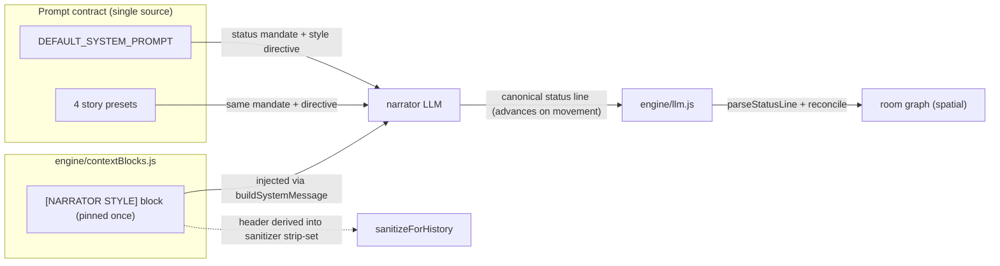

## Context

The spatial room graph (archived `spatial-map-region-graph`) is verified working through every layer — mock sweep, unit tests, and controlled portal/time repro. But four natural live-LLM playtests converged on one wall: the map freezes at 1–3 rooms because the narrator (`dolphin-mistral-24b`) keeps echoing a **stale location in its `[Status: ...]` line** even after its prose narrates travel. The engine commits location from the status line (by design), so it never sees a new location to reconcile. Separately, the peer wants the narrator to be a **flexible stylist** — lean into the player's opening tone, then hold it.

This change is a **prompt-contract + context-block** change, not an engine-logic change: fix the status mandate and add a stable style. It reuses the two seams built this session: the single-source status contract (`STATUS_FORMAT`) and the block registry (`engine/contextBlocks.js`).

## System Architecture Diagram

## Goals / Non-Goals

**Goals:**
- Narrator MUST emit the status line every turn and advance `Location` when it narrates movement.
- Adopt the player's implied style once; hold it for the session.
- Expose the adopted style as a `[NARRATOR STYLE]` registry block (auto strip-eligible).
- Keep the engine's reconciliation/commit path unchanged.

**Non-Goals:**
- No engine-logic change to `reconcile` / `parseStatusLine` / the forged-status guard.
- No "mobile narrator" default decision (whether to always move the player) — orthogonal.
- No narration-parsing heuristics to recover from a stale status line (deferred).
- No map visualization / pathfinding (GH #35).
- No new dependencies.

## Decisions

### D1. Fix the prompt contract, not the parser
The failure is the model not updating its status line. The parser and reconciliation are correct. So the fix is a **stronger mandate in the prompt** (shared across `DEFAULT_SYSTEM_PROMPT` and presets): "When your narration moves the player, the status line's Location MUST name the new place." Rationale: cheapest correct step, zero new deps. **Alternative rejected:** a deterministic "health check" that parses narration for movement — fragile, deferred.

### D2. Style captured once, pinned via a registry block
Add `[NARRATOR STYLE]` to `engine/contextBlocks.js`. The engine captures the adopted style (from the player's opening / first few turns) into state, and the block renders it on every subsequent turn so the narrator never drifts. Registry-driven means the sanitizer's strip-set covers it automatically. **Alternative rejected:** a second LLM call to re-detect style each turn — latency + cost, and the block already pins it.

### D3. Frontend default literal must stay in agreement
`web/static/js/app.js` declares the zero-build default prompt literal, pinned by a source-text test. The new status mandate + style directive must be reflected there too, or the pin test fails. Update it in the same change.

### D4. Status-line mandate wording is the lever
The precise wording matters more than the mechanism. Draft: "At the very end of EVERY response, on a new line, you MUST append the current status in this exact format: [Status: ...]. When the player moves to a new place, the Location field MUST be the new place's name." This targets the observed stale-echo behavior directly.

## Risks / Trade-offs

- **[Narrator compliance]** The mandate may still not move the default model's status line. → Fallback is the deferred narration-parsing health check; the mandate is the cheap first lever and provably fixes the cooperative model (`deepseek-v4-pro`).
- **[Prompt bloat]** A longer default prompt slightly increases token cost per turn. → Negligible (a few lines); the status mandate already exists, we're sharpening it.
- **[Contract drift]** Touching `DEFAULT_SYSTEM_PROMPT` / presets risks the pinned frontend literal and mock agreement. → Source-text pin tests guard it; update `app.js` in the same change.
- **[Style pinning]** Holding a style could feel rigid if the player deliberately changes tone mid-session. → Accepted for v1 (consistency is the stated goal); a future "re-style on explicit player change" is a refinement.

## Migration Plan

- Deploy as one commit: update the four prompt sources + `app.js`, add the `[NARRATOR STYLE]` block + style capture, update the source-text pin tests.
- Rollback: revert the commit; the previous prompts and registry are fully restored (no data migration).
- Existing sessions load unchanged; the mandate only affects future turns.

## Open Questions

- Should the engine auto-detect the style (from the first turn's prose) or let the player/init set it explicitly? Default: auto-detect on first turns, with an optional explicit override.
- Whether a deliberately changed player tone mid-session should re-style the narrator (v1 says no; refinement later).
