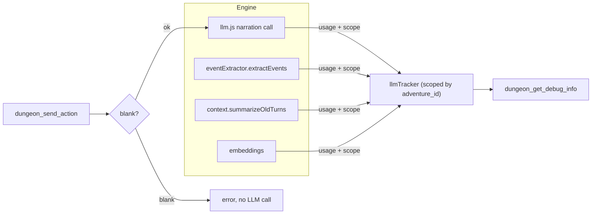

## Context

`engine/llmTracker.js` is a process-global singleton: `startCall`/`endCall` accumulate regardless of adventure, and `mcp/tools/diagnostics.js:dungeon_get_debug_info` reads it wholesale. Live confirmation: after init-ing adventure B, `get_debug_info` still listed all of adventure A's 19 calls and cost, with only `backend_status.adventure_id` correct. Non-narration calls (`extraction`, `summarization`, `embedding`, `embedding_batch`) record `tokens: {input: 0, output: 0}` because those call sites never capture usage. `dungeon_send_action` accepts any text including whitespace-only (`mcp/tools/gameplay.js`), spending a real OpenRouter call.

## System Architecture Diagram

## Goals / Non-Goals

**Goals:**
- `dungeon_get_debug_info` reflects the current session only.
- Session cost includes all call types (or is honestly labeled).
- Blank actions are rejected with zero LLM spend.

**Non-Goals:**
- Not changing which call types exist.
- Not persisting per-adventure tracker state to disk (session-scoped only).
- Not a billing/accounting system — just accurate reporting.

## Decisions

**D1 — Scope `llmTracker` by `adventure_id` via an optional scope argument or a `setAdventure(id)`/`reset()` call.**
`newAdventure`/`load` set the scope; `startCall` records calls under the current scope; `getCalls`/`getSessionCost`/`getDebugLogs` read the current scope. *Alternative rejected:* one tracker per adventure instance — the engine already keeps a single tracker; scoping keys are simpler.
*Note:* `debug_logs` (ring buffer) is shared with the same issue — scope or reset it the same way.

**D2 — Capture usage in non-narration call sites.**
`eventExtractor.extractEvents`, `context.summarizeOldTurns`, and `embeddings` call `startCall` with `{input:0, output:0}`; capture the response's usage fields (where available) before `endCall`. Where the provider returns no usage (some embedding endpoints), record what's available and let the breakdown reflect it. *Alternative:* relabel the field and break out by type — acceptable fallback if usage capture proves unreliable.

**D3 — Blank-action rejection in `dungeon_send_action` (and mirror in engine if the web UI has the same gap).**
Validate `text.trim().length === 0` → error, no LLM call, no history push. *Note:* the engine-side `formatUserInput` turns `"   "` into `"> "` (a `>` prefix), so validation must happen before formatting.

## Risks / Trade-offs

- **[D1 scoping]** → Breaking existing consumers that rely on lifetime totals. Mitigation: `get_debug_info` is the only consumer; confirm its tests.
- **[D2 usage capture]** → Some endpoints may not return usage (embeddings). Mitigation: capture-what's-available + honest labeling; don't fail the call if usage is absent.
- **[D3 blank rejection]** → The engine still accepts `"> "` if called outside MCP. Mitigation: mirror the check in `formatUserInput` or the engine entry point.
- **[debug_logs scoping]** → Interleaved logs across adventures are the same bug; reset on `setAdventure` to keep them coherent.
