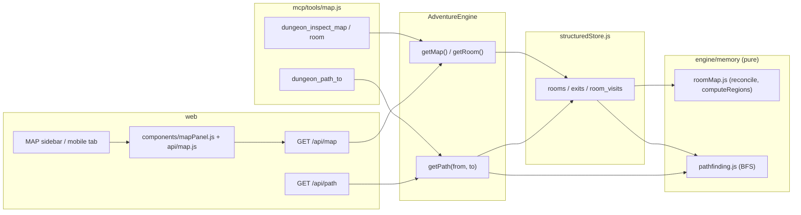

## Context

The spatial room graph (archived `spatial-map-region-graph`) is live: `rooms`/`exits`/`room_visits` persist in SQLite, `engine/memory/roomMap.js` reconciles every turn, and `GET /api/map` / `dungeon_inspect_map` expose the graph. The graph is directed; reverse traversal is captured as `inferred=1` edges; portal/time edges cross region seams; `computeRegions` groups walk-connected rooms.

Two capabilities are missing to make the graph usable rather than merely inspectable: a way to *plan through* it (deterministic routing) and a way to *see* it (a map panel). This change adds both by consuming the existing tables and `computeRegions` — no new storage and no new npm dependencies. It follows the established seam: a pure module, a thin engine proxy, thin MCP/HTTP surfaces, and a co-located frontend component. The frontend is zero-build; the map renderer is the one open implementation decision (hand-rolled canvas/DOM vs a vendored ESM graph library).

## System Architecture Diagram

## Goals / Non-Goals

**Goals:**
- Deterministic, directed, walk-only routing over the recorded graph — region-aware, never fabricating connectivity.
- A frontend map panel with cartographic and node-graph modes, current-room highlight, and visited state.
- Thin MCP and HTTP surfaces reusing the shared read-through freshness helper.

**Non-Goals:**
- Portal-admitting routing (walk-only v1; a portal mode is a follow-up).
- Fuzzy/vector room-name matching (the known duplicate-node limitation).
- `dungeon_navigate` (LLM-free movement along a route).
- The verification harness (`synthetic-narrator`, `spatial-playtest-verification`) — a separate change.
- New npm dependencies.

## Decisions

### D1. Pure routing module (`engine/memory/pathfinding.js`)
Routing lives in a pure module mirroring `roomMap.js`: `findRoute(rooms, edges, fromId, toId)` takes raw store-row shapes (the same shape `computeRegions` consumes), holds no store handle, and is unit-testable without an LLM. Adjacency is built deterministically — sorted by `(direction ?? '', to_room)` — because `getEdges` is an unsorted `SELECT *`, and route determinism is a requirement.

### D2. Directed walk-only BFS
The search traverses `kind='walk'` edges in their recorded direction only; `portal` and `time` edges are not traversed. Null-direction edges (directionless one-way walks) are traversable and surface a fallback direction label. `inferred` is stamped on each step so a caller knows the route leans on an assumption reconciliation may later retract. BFS over unweighted edges is shortest-hop by construction, which closes the "shortest-vs-first" question — there is no separate ranking.

### D3. Failure classification via `computeRegions`
When no route is found, `computeRegions` over the walk edges classifies the failure: target in a different component → `different_region` (the designed "genuine mystery" signal); same component but no directed path → `no_route`. Unknown room ids return `null` rather than a fabricated result.

### D4. Uniform route payload
The result shape is identical at every layer: `{ found, from_room_id, to_room_id, step_count, steps: [{ from_room_id, from_room_name, direction, to_room_id, to_room_name, kind, inferred }] }`, or `{ found: false, ..., step_count: 0, steps: [], reason }`. The pure module returns ids; the engine proxy and outer surfaces resolve room names from the registry.

### D5. Engine proxy
`AdventureEngine.getPath(fromRoomId, toRoomId)` is a thin proxy in the existing spatial proxy block, feeding the store's raw `getEdges()` rows; it returns `null` for unknown ids (mirroring `getRoom`). No reconciliation change.

### D6. Renderer — open decision
The map renderer is deliberately left open: a hand-rolled canvas/DOM renderer (default; no committed asset, full control, manual hit-testing) versus a vendored ESM graph library (buys zoom/pan/selection at ~500 KB committed; vendoring preserves the no-build/no-CDN constraint). The spec is renderer-agnostic. Whichever is chosen, a pure layout/elements seam keeps the render testable.

### D7. Map panel integration
`web/static/js/api/map.js` fetches `/api/map` (per-domain client convention); `web/static/js/components/mapPanel.js` renders it (component convention). The panel mounts as a MAP sidebar tab (and mobile-tab entry) and refreshes through the existing post-turn render cycle in `api/streaming.js`.

### D8. Surfaces reuse freshness
`dungeon_path_to` (in `mcp/tools/map.js`) and `GET /api/path` (in `web/routes/game.js`) reuse the shared `forceFlushBeforeRead` helper — no per-surface flush ceremony.

## Risks / Trade-offs

- **[Visible soft spot] Duplicate nodes from exact-name matching become visible in the map.** → Accepted; fuzzy matching is deferred, and the map makes the limitation legible rather than hidden.
- **[Live gate] Routing usefulness depends on edge density in real play.** → The narrator-fidelity gate proved rooms grow and GH #39 restored first-person edge recording, but the edge density of a natural session is unmeasured; the Wanderer playtest is the pre-build gate for the visualization slice.
- **[Renderer] Library adds a ~500 KB committed asset and a third-party API surface; hand-rolled adds interaction-maintenance cost.** → Kept open; D6 records the trade-off.
- **[Frontend] The panel hooks the post-turn render path flagged by GH #31 (zombie store / two render paths).** → Scope the panel to the existing cycle; do not refactor the store here.
- **[Determinism] Route stability depends on sorted adjacency.** → Explicit in D1 and covered by a determinism scenario.
