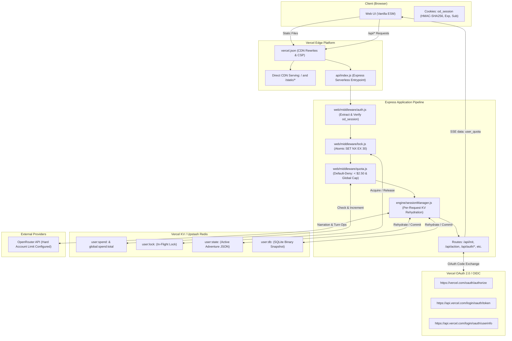

# Technical Architecture: Vercel Deployment & OAuth Spend Quota Enforcement

## Context

OpenDungeon was originally architected as a local-first Node.js Express service running single-user sessions with local filesystem persistence (`game/adventures/`) and optional proxying to OpenRouter. Deploying OpenDungeon to public serverless infrastructure (Vercel) introduces distinct challenges:
1. **Financial Abuse Risk**: Public access without gating allows bots or bad actors to exhaust upstream OpenRouter API credits. All LLM-touching routes must be protected under a default-deny policy.
2. **Stateless Multi-Instance Execution**: Vercel functions are ephemeral and horizontally scaled. Sequential turns from the same user often hit different Lambda containers. State stored in memory or container-local `/tmp` is wiped on cold starts.
3. **Module-Load Disk Writes**: Constructing singletons at module import time that write to `/var/task` causes cold-start crashes (`EROFS`).
4. **Authentication & Identity**: "Sign in with Vercel" (OAuth 2.0 / OIDC) provides developer-grade identity gating, which must be paired with an authoritative ledger to enforce a strict lifetime limit of $2.50 per user account and a global spending kill-switch.

## System Architecture Diagram

## Goals / Non-Goals

**Goals:**
- **Zero-Friction Vercel Deployment**: Host the entire application on Vercel with direct CDN delivery for static assets and serverless execution for `/api/*`.
- **Stateless Cross-Container Continuity**: Rehydrate adventure state and SQLite database snapshot from Vercel KV on every turn, completely surviving container cold starts and re-routing.
- **Strict $2.50 Per-User Spend Cap**: Authoritatively track accumulated OpenRouter cost in KV keyed by OpenID `sub`, enforcing a strict $2.50 lifetime cap per account.
- **Global Project Spend Kill-Switch**: Halt all LLM operations if aggregate project spend across all users reaches a configurable safety threshold ($50.00).
- **Default-Deny Gating**: Protect all cost-incurring routes (`/api/init`, `/api/action`, `/api/summary`, `/api/lore`, etc.) behind authentication and quota checks.
- **In-Flight Concurrency Protection**: Prevent parallel turn overspend race conditions via atomic KV locks (`SET NX EX 30`).
- **Cold-Start Safety**: Remove `web/engineInstance.js` and eliminate all import-time synchronous filesystem writes.
- **Fail-Closed Security**: Reject execution in production if required cryptographic secrets or OpenRouter credentials are missing or if mock mode is accidentally enabled.

**Non-Goals:**
- **In-App Billing**: Refilling or purchasing credits beyond the $2.50 free allocation.
- **Vectra Semantic Embeddings on Edge**: OpenRouter mode sets `embedding_model: null`; vector database hosting is out of scope.
- **Legacy Python CLI Edge Hosting**: Running the deprecated Python CLI proxy (`game/adventure_engine.py`) on Vercel.

## Decisions

### 1. Per-Request KV State & SQLite Synchronization vs. Container-Local `/tmp`
- **Decision**: In serverless mode (`VERCEL === '1'`), serialize active adventure state (`engine.state.toJSON()`) and SQLite binary snapshot (`engine.memory.structuredStore.db.serialize()`) to Vercel KV (`user:state:<subId>`, `user:db:<subId>`) at the end of each turn, and rehydrate them at request start.
- **Rationale**: Container-local `/tmp` is wiped on cold starts and not shared across horizontal Lambda instances. Without per-request KV synchronization, a user's next turn on a different container starts from an empty adventure.
- **Alternatives Considered**:
  - *Assume container stickiness*: Leads to silent loss of progress on cold starts.
  - *External Postgres / Supabase*: Heavy operational overhead and connection limits compared to lightweight KV key-value storage.

### 2. Default-Deny Route Gating vs. Action-Only Allowlist
- **Decision**: Apply authentication and quota verification as a default-deny middleware across all endpoints that can invoke LLM generation (`/api/init`, `/api/action`, `/api/summary`, `/api/lore`, `/api/scan`, `/api/goals/complete`).
- **Rationale**: Leaving `/api/init` unprotected allows attackers to spam opening scene completions and exhaust the developer's OpenRouter credits without authenticating or touching `/api/action`.
- **Alternatives Considered**:
  - *Per-route manual checks*: High risk of developer oversight when adding new routes.

### 3. In-Flight Turn Lock & Global Project Kill-Switch
- **Decision**: Acquire an atomic lock (`SET user:lock:<subId> 1 NX EX 30`) during LLM generation. Maintain an aggregate project counter (`global:spend:total`) capped at $50.00.
- **Rationale**: A user firing 20 concurrent requests at $2.49 could otherwise bypass the per-user cap before the first request records its spend. A global cap protects against attackers creating dozens of free Vercel accounts to drain credits.
- **Alternatives Considered**:
  - *Pre-deducting estimated balance*: Complicated rollback logic if generation fails or streams abort early.

### 4. Direct CDN Static Asset Serving vs. Serverless Function Asset Serving
- **Decision**: Route `/` to `web/templates/index.html` and `/static/(.*)` to `web/static/$1` in `vercel.json` rewrites. Express handles only `/api/(.*)` via `api/index.js`.
- **Rationale**: Serving static JS, CSS, and audio files through serverless Express functions consumes execution limits, introduces cold-start latency for UI assets, and incurs unnecessary compute costs. Vercel's Edge CDN serves static files globally with zero compute latency.

### 5. Elimination of Import-Time Side Effects
- **Decision**: Delete `web/engineInstance.js`. Ensure no module constructor executes `fs.mkdirSync`, `new Database()`, or filesystem writes during `import`. Instantiate `AdventureEngine` lazily in `sessionManager.js` with storage roots resolving in `/tmp/open-dungeon/...`.
- **Rationale**: Vercel Lambda container environments mount the application source tree as read-only (`/var/task`). Top-level synchronous directory or database creation crashes the function during cold start with an unrecoverable `EROFS` error.

### 6. Constant-Time HMAC Verification with Length Guards and Expiration
- **Decision**: Session cookies (`od_session`) contain `{ sub, email, name, iat, exp, v: 1 }` with signature `<payload>.<sig>`. Comparison verifies `Buffer.byteLength(sig) === Buffer.byteLength(expectedSig)` before `crypto.timingSafeEqual` and checks `Date.now() / 1000 < exp`. Cookie flags: `HttpOnly; Secure; SameSite=Lax; Path=/; Max-Age=604800`.
- **Rationale**: Calling `timingSafeEqual` with unequal buffer lengths throws a runtime exception in Node.js. Explicit length guards prevent crashes and timing leaks. Expiration timestamps prevent infinite session validity.

## Risks / Trade-offs

| Risk | Mitigation |
| :--- | :--- |
| **Vercel KV Storage Quotas** | Adventure JSON is ~10KB and serialized SQLite is ~30–80KB. KV handles key sizes up to 10MB, easily supporting user state without exceeding limits. |
| **Simultaneous Request Conflicts** | The in-flight lock (`user:lock:<subId>`) rejects overlapping actions with HTTP 429, serializing mutations and eliminating SQLite write races. |
| **Missing Secrets on Edge Deployment** | `web/config.js` fails closed during boot if `VERCEL === '1'` and `VERCEL_APP_CLIENT_SECRET`, `SESSION_SECRET`, or `OPENROUTER_API_KEY` are missing, or if `MOCK_LLM === '1'`. |
| **Serverless Execution Timeout** | `api/index.js` is configured with `maxDuration: 60` in `vercel.json`, and SSE calls `res.flushHeaders()` to stream narration chunks immediately. |
| **OpenRouter Dashboards vs Code Quotas** | In addition to software limits ($2.50 per user, $50 global), the developer sets a hard credit limit on the OpenRouter dashboard as the ultimate financial backstop. |
